# Generative AI with Large Language Models (LLM)

  

## Contact info

Reach out to me at one of the following places!

- **Website at** <a href="https://www.linkedin.com/in/oktay-tuncay-8b147724/" target="_blank">`linkedin.com`</a>
- **Email:** oktaytncy@gmail.com

# Table of Contents

---
- [Generative AI with Large Language Models (LLM)](#generative-ai-with-large-language-models-llm)
  - [Contact info](#contact-info)
- [Table of Contents](#table-of-contents)
  - [Back to Basics: Core Concepts Explained](#back-to-basics-core-concepts-explained)
    - [What is Generative AI and LLM](#what-is-generative-ai-and-llm)
    - [LLM Use Cases and Practical Tasks](#llm-use-cases-and-practical-tasks)
    - [The Foundations of Text Generation](#the-foundations-of-text-generation)
  - [Technical Perspectives](#technical-perspectives)
    - [Transformer Architecture](#transformer-architecture)
      - [Working Principle](#working-principle)
    - [Generating Text with Transformer Models](#generating-text-with-transformer-models)
    - [Prompt Engineering Basics](#prompt-engineering-basics)
    - [Generative configuration](#generative-configuration)
    - [GenAI Projects Lifecycle](#genai-projects-lifecycle)
      - [Identification of Use-Case and It's Scope](#identification-of-use-case-and-its-scope)
      - [Model Selection](#model-selection)
      - [Adapt and Align model](#adapt-and-align-model)
      - [Application Integration](#application-integration)
    - [Pre-Training LLMs](#pre-training-llms)
    - [Challenges of training LLMs](#challenges-of-training-llms)
    - [Optimal Computational Models](#optimal-computational-models)
    - [Domain Adaptation](#domain-adaptation)
  - [Instruction of LLM Fine-Tuning](#instruction-of-llm-fine-tuning)
    - [Single-Task Fine-Tuning](#single-task-fine-tuning)
    - [Model Evaluation](#model-evaluation)
    - [Benchmarks and Results](#benchmarks-and-results)
  - [Optimized Parameter Adjustment for Enhanced Model Training](#optimized-parameter-adjustment-for-enhanced-model-training)
    - [PEFT Methods](#peft-methods)
      - [PEFT Trade-offs](#peft-trade-offs)
      - [PEFT techniques 1: LoRA](#peft-techniques-1-lora)
      - [PEFT techniques 2: Soft Prompts](#peft-techniques-2-soft-prompts)
  - [Aligning Models with Human Values](#aligning-models-with-human-values)
  - [Reinforcement Learning From Human Feedback (RLHF)](#reinforcement-learning-from-human-feedback-rlhf)
    - [RLHF: Obtaining Feedback From Humans](#rlhf-obtaining-feedback-from-humans)
    - [RLHF: Reward model](#rlhf-reward-model)
    - [RLHF: Fine-Tuning with Reinforcement Learning](#rlhf-fine-tuning-with-reinforcement-learning)
    - [RLHF: Reward Hacking](#rlhf-reward-hacking)
    - [Scaling Human Feedback](#scaling-human-feedback)
  - [Model Optimizations for Deployment](#model-optimizations-for-deployment)
  - [Generative AI - Time and Effort in the Lifecycle](#generative-ai---time-and-effort-in-the-lifecycle)
  - [LLM and Applications](#llm-and-applications)
  - [Program-Aided Language Models (PAL)](#program-aided-language-models-pal)

## Back to Basics: Core Concepts Explained

### What is Generative AI and LLM

Generative AI refers to the type of artificial intelligence that can generate new content based on the data it has learned from. It's like teaching a computer to be creative. For example, after showing a generative AI lots of pictures of cats, it can create a brand new image of a cat that doesn't exist. Or, if you feed it lots of music, it might be able to compose a new song in the style of what it's heard.

LLM stands for **Large Language Model**, which is a type of AI that's been trained on a huge amount of text. It's designed to understand and generate human-like text by predicting what word comes next in a sentence. Because it's read so much text, it can do a lot of cool things with words.

### LLM Use Cases and Practical Tasks

Large Language Models (LLMs) like generative AI are commonly associated with chatbot functions due to their visibility and popularity. However, the underlying next-word prediction technology enables a wide range of text generation tasks, such as essay writing, summarizing dialogues, and translation between languages or into machine code.

Moreover, LLMs can perform specific tasks like named entity recognition, extracting information such as people and places from texts. The potential of LLMs extends to interfacing with external data sources and APIs, enhancing their capabilities beyond their initial training.

With the growth in the scale of foundation models, the nuanced understanding and processing ability of language by these models have significantly improved, making them adept at solving complex tasks, although smaller models can also be specialized for particular functions.

### The Foundations of Text Generation

Generative algorithms have been around for some time, with earlier language models relying on recurrent neural networks (RNNs). While RNNs were advanced for their era, they required substantial computational power and memory to perform generative tasks effectively.

An RNN that tries to predict the next word with limited previous words tends to fail because it lacks sufficient context to make accurate predictions. The complexity of the language further compounds this difficulty.

The transformative moment for generative AI came with the 2017 paper [Attention is All You Need](https://arxiv.org/abs/1706.03762), introducing the transformer architecture.

This new model is more efficient, capable of parallel processing, and uses larger datasets, which importantly allows it to understand the meaning of words through its attention mechanism, marking a significant advance in AI capabilities.

## Technical Perspectives

### Transformer Architecture

Transformers are a type of language model that performs much better than older ones on language tasks. They can understand the importance of each word in a sentence by using something called attention weights.

This lets the model figure out complex relationships.

**For example:** The teacher taught math the student with a book.

Did the teacher teach using the book or did the student have the book or was it both?

In 2017, a groundbreaking paper called **Attention Is All You Need** was published by researchers from Google and the University of Toronto.

This introduced the transformer architecture, which has led to the advancements in AI that we see today. Transformers are efficient because they can be scaled to run on many GPU cores, allowing them to handle big datasets all at once.

Most importantly, they can learn the meaning of words, which is essential for understanding and generating language.

Self-attention is a feature that helps a model understand how words in a sentence relate to each other. For instance, the model might recognize that the word "book" is closely related to "teacher" and "student" in a sentence. This ability lets the model see the full picture of the sentence, improving how it represents and processes language.

  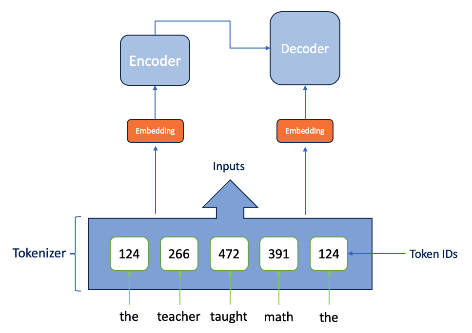

Transformers consist of encoders and decoders that process language by first converting words into numerical forms, a step known as tokenization.

A specific layer then interprets the meanings of these numerical values. The model also maintains the sequence of words to make sense of sentences. It employs multiple **attention heads** to focus on various elements of language, which helps it predict what word comes next with high accuracy.

#### Working Principle

  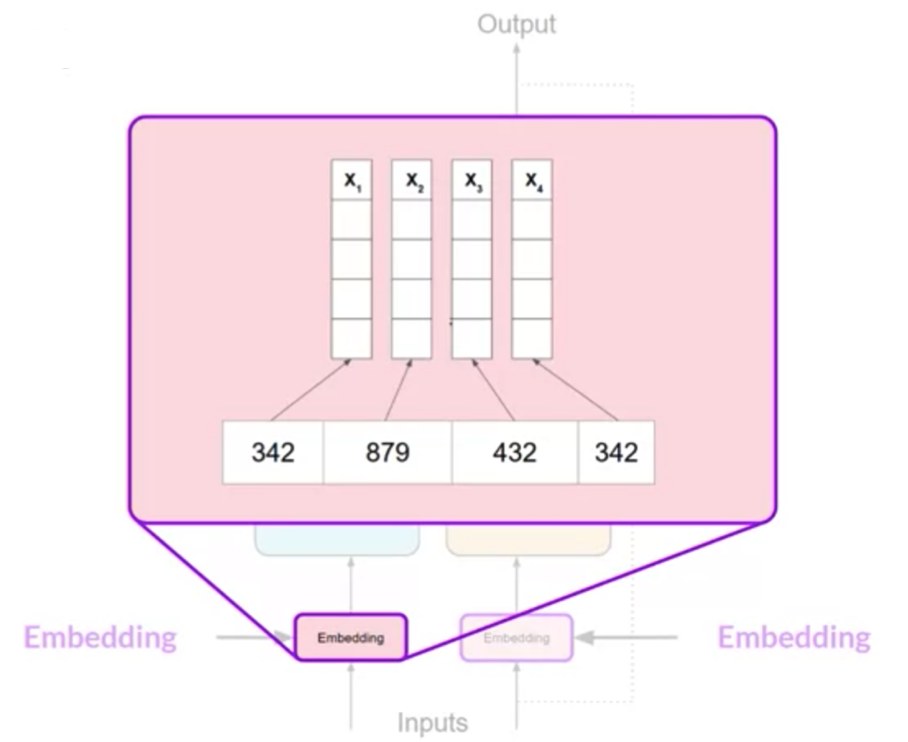

Machine learning models are essentially complex statistical tools that need to work with numbers instead of words. To prepare text for these models, you have to convert words into numerical values through tokenization.

There are different ways to tokenize, some match whole words to numbers, and some match parts of words. It's crucial to use the same tokenization method throughout the training and text generation process.

Once words are tokenized, they're fed into an embedding layer. This layer is a place where each number (representing a word or part of a word) gets a unique vector in a high-dimensional space. These vectors help the model understand the meaning and context of words.

This concept isn't new; it's been used in earlier language processing tools like Word2vec.

The model processes each of the input tokens in parallel. So, by adding positional coding, you preserve information about word order and do not lose the relevance of the word's position in the sentence. After collecting the input tokens and spatial encodings, you pass the resulting vectors to the self-attention layer.

  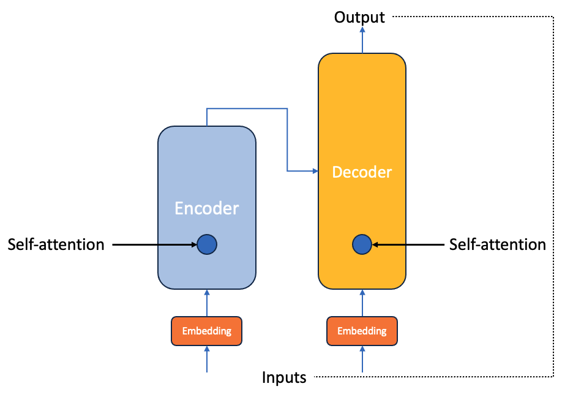

Here, the model analyzes the relationships between the tokens in your input sequence. This allows the model to attend to different parts of the input sequence to better capture the contextual dependencies between the words.

The self-attention weights that are learned during training and stored in these layers reflect the importance of each word in that input sequence to all other words in the sequence.

But this does not happen just once, the transformer architecture actually has multi-headed self-attention. This means that multiple sets of self-attention weights or heads are learned in parallel independently of each other.

For example, one head may see the relationship between the people entities in our sentence. While another head may focus on the activity of the sentence. Another head may focus on some other properties such as if the words rhyme.

It is important to note that you do not dictate ahead of time what aspects of language the attention heads will learn. The weights of each head are randomly initialized and given sufficient training data and time, each will learn different aspects of language.

  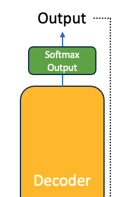

Now that all of the attention weights have been applied to your input data, the output is processed through a fully connected feed-forward network.

The output of this layer is a vector of logits proportional to the probability score for each and every token in the tokenizer dictionary.

You can then pass these logits to a final **softmax layer**, where they are normalized into a probability score for each word. This output includes a probability for every single word in the vocabulary, so there is likely to be thousands of scores here.

One single token will have a score higher than the rest. This is the most likely predicted token.

### Generating Text with Transformer Models

The transformer model is made up of encoder and decoder parts. The encoder turns the input into a detailed representation of its meaning. The decoder then uses this to create new parts of text, like words or sentences, until it's finished. Although the example given includes both an encoder and a decoder, you can also use just one of them for different tasks.

Models that only use the encoder are good for when the input and output are the same size, like with some types of analysis, and BERT is an example of this. However, you can add more to these models to make them do other tasks, too.

Models with both encoders and decoders are great for when the input and output are different sizes, like in translation. These can also be used for creating text. T5 is an example of this kind of model.

Decoder-only models, like the GPT series and others, are very common and versatile. They can do many different tasks and have become more powerful as they've been developed further.

| Encoder Only | Decode Only    | Encoder + Decoder |
| -----------  | -------------- | ----------------- |
| BERT         | Transformer-XL |  Transormer|
| RoBerta      | XLNet          |  XLM|
| Reformer   | GPT Series     |  T5               |
| FlauBERT     | Cohere         |  BART             |
| CamemBERT   | DialoGPT       |  XLM-RoBerta      |
| Electra      |                |  Pegasus          |
| MobileBERT   |                |  mBART            |

### Prompt Engineering Basics

  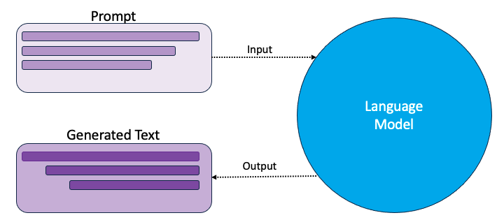

The text that you feed into the model is called the prompt, the act of generating text is known as inference, and the output text is known as the completion. The full amount of text or the memory that is available to use for the prompt is called the context window.

You may need to review the language or spelling in your prompt several times to make sure the model behaves the way you want. This work to develop and improve the system is known as prompt engineering.

One of the powerful strategies that will enable the model to produce better results is to include examples of tasks that you want the model to perform in the prompt.

Providing examples inside the context window is called in-context learning. With in-context learning, you can help LLMs learn more about the task being asked by including examples or additional data in the prompt.

  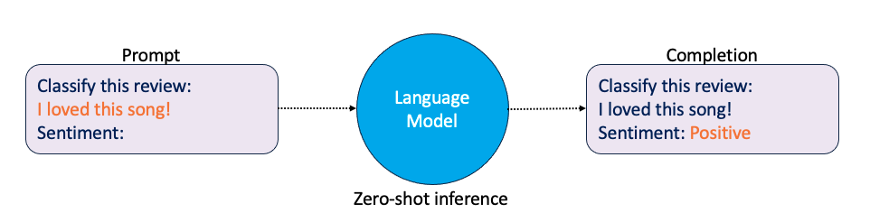

In the example given, you're using a language model to figure out if a song review is positive or negative. You do this by telling the model, *Classify this review*, and then you show it the review.

The model is supposed to read the review and then say if the review is positive or negative. This approach, where you just give the model a task and some information without any extra training, is called **zero-shot inference**.

The biggest and most advanced language models are really good at understanding these kinds of tasks and giving the right answers, even if they've never done that exact task before.

In this example, the model correctly identifies the sentiment as positive.

  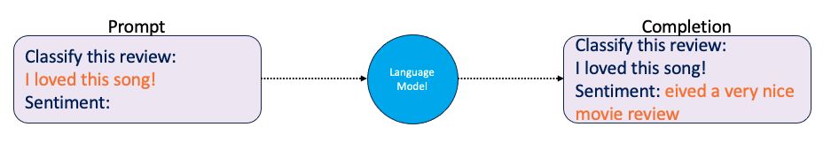

Smaller models, like GPT-2, may not do as well with zero-shot inference, which means they might not understand or complete tasks correctly without specific training.

If you ask a smaller model to classify the sentiment of a review, it might just write something related to the review but not actually say if the sentiment is positive or negative. It struggles to grasp the specific task you're asking it to perform.

  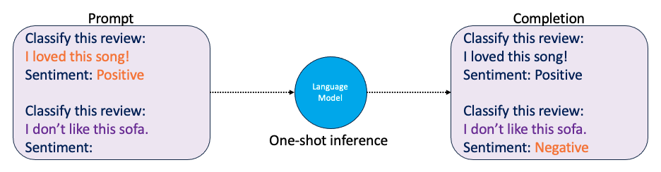

Giving a model an example can make it do better at a task. You can make the prompt longer and start with an example that shows the model what to do.

For instance, after you tell the model to classify a review, you can add a review like *I loved this song* and then show the model how to analyze it by writing *Positive sentiment.* This is like giving the model a hint about what you expect it to do.

By including an example in the prompt, you're showing the smaller model what you want it to do. First, you give it an example of a review and the correct sentiment analysis (like *Positive* for a good review).

Then you repeat the instruction and add the new review you actually want to be analyzed. This longer prompt helps the smaller model understand the task and how to respond. This method, where you give one example to guide the model, is called **one-shot inference**, which is different from zero-shot inference where no examples are provided.

  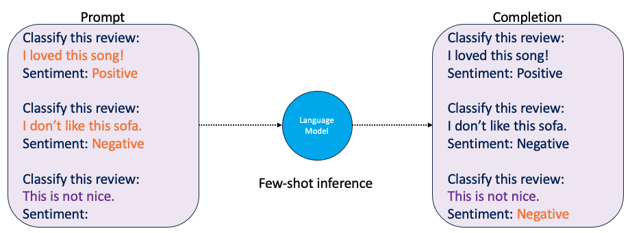

If one example isn't enough for the model to understand a task, you can use a **few-shot inference** approach. This means giving the model several examples.

For instance, if a model didn't do well with one-shot inference for sentiment analysis, you might give it two examples: one with a positive review and another with a negative review.

By showing the model different kinds of reviews and the right sentiment analysis for each, you help it learn what you're asking for. When you then give it the actual review you want analyzed, the model is more likely to understand the task and give you the correct sentiment, positive or negative.

  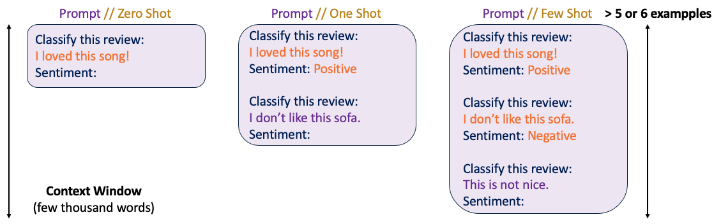

Prompt engineering involves designing your prompts to help the model learn from examples. Big models can often understand tasks with zero examples (zero-shot inference), but smaller models might need one example (one-shot inference) or a few (few-shot inference) to perform well.

However, there's a limit to how much information you can include in a prompt because of the model's context window—the amount of text it can look at one time.

If adding several examples doesn't help the model to understand, it might be time to fine-tune the model. Fine-tuning is like giving the model extra lessons with new data to get better at the specific task you want it to do.

The bigger a model is, meaning the more parameters it has, the better it can understand language and do different tasks. The largest models can even figure out how to do tasks they weren't directly trained for, which is known as zero-shot inference. Smaller models, though, usually aren't as flexible. They tend to do well only on tasks that are like the ones they were trained on.

### Generative configuration

  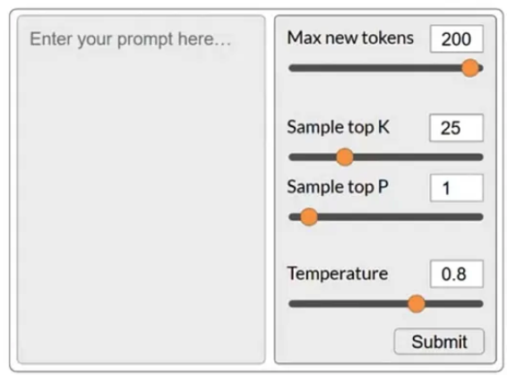

Lets examine some of the methods and associated configuration parameters that you can use to influence the way that the model makes the final decision about next-word generation.

If you've used LLMs on playgrounds like the Hugging Face website, or Cohere, you may have been presented with controls like this to adjust how the LLM behaves. Each model introduces a set of configuration parameters that can affect the model's output during inference.

Note that these are different from the training parameters learned during the training period. Instead, these configuration parameters are called at inference time, giving you control over things like the maximum number of tokens in completion and how creative the output is.

**Max new tokens** is probably the simplest of these parameters, and you can use it to limit the number of tokens that the model will generate. You can think of this as putting a cap on the number of times the model will go through the selection process.

The output from the transformer's softmax layer is a probability distribution across the entire dictionary of words that the model uses.

  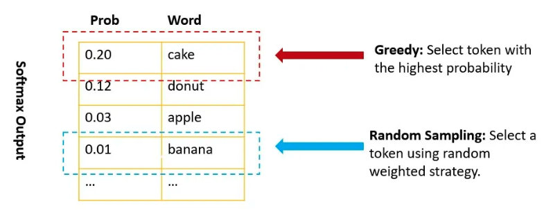

Here you can see a selection of words and their probability score next to them. Although we are only showing four words here, imagine that this is a list that carries on to the complete dictionary. Most large language models by default will operate with so-called **Greedy decoding**.

Greedy decoding in language models always picks the next word with the highest probability score. While this can be effective for short texts, it can lead to repetition in longer ones. To make the text more varied and creative, you can use a method called **Random sampling**.

Random sampling adds variability by choosing words based on their probability scores. So a word with a probability of 0.01 would have a 1% chance of being chosen. This method reduces the chance of repeating words, but if not calibrated properly, it can make the text too random or off-topic.

In some systems, like Hugging Face's transformers, you must turn off greedy decoding and enable random sampling by changing the settings **do sample** to true, for example. This switch allows the model to use the probabilities to guide its choice, making the output more diverse.

**Top-k** and **top-p** sampling techniques to help limit random sampling and increase the chances of the output being meaningful. Two Settings, top-k, and top-p, are sampling techniques we can use to help limit random sampling and increase the chances of the output being meaningful.

  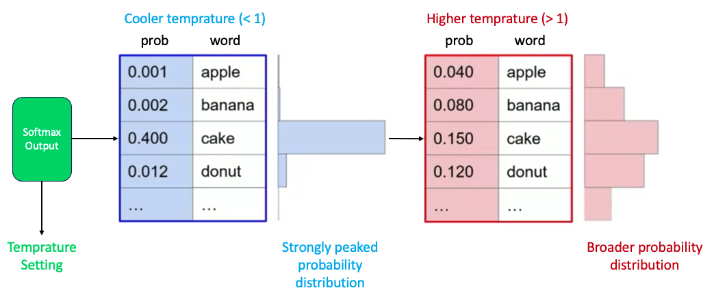

**The temperature** value is a scaling factor applied to the final softmax layer of the model, that impacts the shape of the probability distribution of the next token. Unlike top-k and top-p parameters, changing the temperature actually changes the predictions the model will make.

Setting a low temperature value (less than one) sharpens the model's probability distribution, concentrating it on fewer words and making the output more predictable and less varied. This can result in text that closely matches what the model has learned, with little randomness.

On the other hand, a high temperature value (greater than one) spreads the probability distribution across a wider range of words, increasing randomness and variability in the generated text. This can make the text seem more creative and less like the typical responses the model was trained on.

If the temperature is set to one, it means no adjustment is made, and the original probability distribution from the softmax function is used for text generation.

### GenAI Projects Lifecycle

  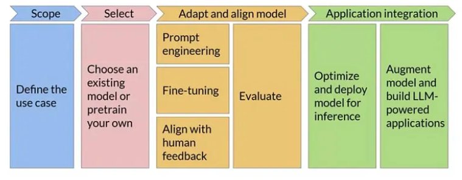

The diagram above belongs to the overall life cycle that we will go into step by step.

#### Identification of Use-Case and It's Scope

When starting a project, it's crucial to clearly define the project's scope as specifically as possible. Large language models (LLMs) have a range of capabilities based on their size and design, and you must consider what role the LLM will play in your project.

Decide whether you need the LLM to perform various complex tasks, like generating extensive texts, or a single specific task, such as identifying named entities. Being precise about your LLM's required functions can save time and reduce computing expenses.

#### Model Selection

After you've clearly defined your model requirements and are ready to start development, you need to decide whether to train a new model from scratch or use an existing one.

Usually, you'll begin with a pre-trained model, but there might be situations where training a new model from the beginning is necessary.

#### Adapt and Align model

Once you have your model, evaluate its performance and consider additional training for your specific needs. Start with prompt engineering, using relevant examples to guide the model. If performance is still lacking, fine-tuning the model is an option.

As models advance, ensuring they align with human preferences and behave appropriately is vital. You might also use a method called reinforcement learning with human feedback to refine the model's behavior. Remember, this process of adapting and aligning your application is iterative, often involving cycles of prompt engineering, fine-tuning, and evaluation to achieve the desired performance.

#### Application Integration

Once your model performs well and aligns with your goals, you can integrate it into your system. Optimize the model for deployment to use your computational resources efficiently and offer the best user experience.

Also, consider any extra infrastructure needed for your application to function effectively. Be aware of inherent limitations of large language models, such as fabricating information or struggling with complex reasoning and math, which might not be fully addressed through training.

### Pre-Training LLMs

Launching a generative AI app involves several steps.

First, determine your app's needs and how the large language model (LLM) will function within it. Then choose whether to use an existing model or train a new one. While there are benefits to training from scratch, most developers start with an existing open-source model from AI community resources, such as those on Hugging Face or PyTorch hubs.

The model you choose depends on the specific language task, influenced by variations in the transformer model architecture and training methods. Understanding LLM training will help you pick the right model for your needs.

LLMs learn during pre-training from huge amounts of text data, developing a deep statistical language understanding. This involves self-supervised learning, where the model internalizes language patterns. These patterns are crucial for the model to meet its training objectives. Pre-training updates the model's weights to minimize loss and requires significant computational power, often utilizing GPUs.

If scraping data from the internet for training, you must process it to ensure quality, reduce bias, and eliminate harmful content. Typically, only a small fraction of the collected tokens, around 1-3%, is suitable for pre-training. This should be factored in when estimating the data needed for training your own model.

  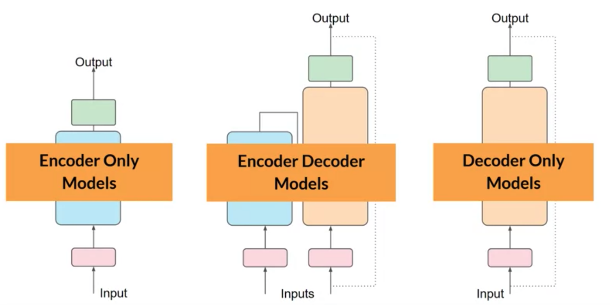

There are three main variations of transformer models: encoder-only, encoder-decoder, and decoder-only. Each type is trained differently and excels at different tasks.

Encoder-only models, also known as autoencoding models, are trained with a masked language modeling objective. They work by randomly masking tokens in the input and learning to predict these to reconstruct the original text, hence the term "denoising objective." These models develop a bidirectional understanding of the context, meaning they consider both the preceding and following tokens in a sequence.

These autoencoding models are particularly useful for tasks that require an understanding of context from both directions, such as sentence-level tasks like sentiment analysis, or token-level tasks such as named entity recognition and word classification. BERT and RoBERTa are prominent examples of encoder-only models.

  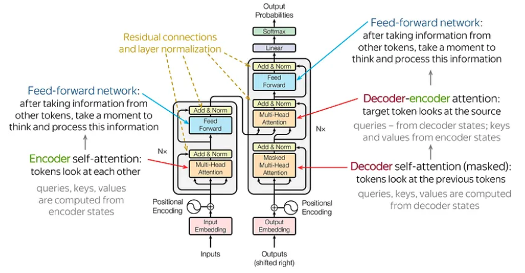

Decoder-only models, or autoregressive models, are pre-trained through causal language modeling. Their training goal is to predict the next token in a sequence based on the preceding tokens. This process is referred to as full language modeling by some researchers.

These autoregressive models operate by masking the future tokens in the sequence, providing the model with a unidirectional context—only the tokens that come before the current one. They build a statistical representation of language by learning to predict subsequent tokens from numerous examples, using only the decoder part of the original transformer architecture without the encoder.

Decoder-only models are commonly used for text generation tasks. Larger models of this type have shown strong abilities in zero-shot inference, meaning they can perform various tasks without specific training. Examples of decoder-only models include GPT and BLOOM.

The sequence-to-sequence models, a third variation, utilize both encoder and decoder components. Pre-training objectives can differ among these models. For instance, the T5 model pre-trains its encoder by span corruption, masking sequences of input tokens and replacing them with unique sentinel tokens. These tokens are placeholders in the model's vocabulary that don't match any real input word.

The decoder of a sequence-to-sequence model then attempts to reconstruct the masked token sequences autoregressively, with the output starting with a sentinel token followed by the predicted tokens. These models are versatile and used in tasks like translation, summarization, and question-answering, where both input and output are textual. BART is another well-known sequence-to-sequence model alongside T5.

  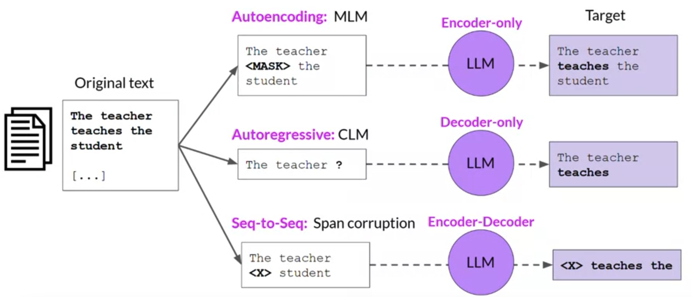

To recap the comparison between model architectures based on their pre-training objectives:

- **Encoder-Only (Autoencoding models) :** Autoencoding models use masked language modeling for pre-training. They are based on the encoder part of the transformer architecture and excel at tasks like sentence and token classification.

- **Decoder-Only (Autoregressive models):** Autoregressive models   are trained using causal language modeling. These rely on the decoder component of the transformer architecture and are typically used for generating text.

- **Encoder Decoder (Sequence-to-sequence models):** Sequence-to-sequence models combine both encoder and decoder parts of the transformer architecture. Their pre-training objectives can vary, with an example being the T5 model, which uses span corruption. These models are well-suited for tasks that involve converting one body of text into another, such as translation, summarization, and question-answering.

  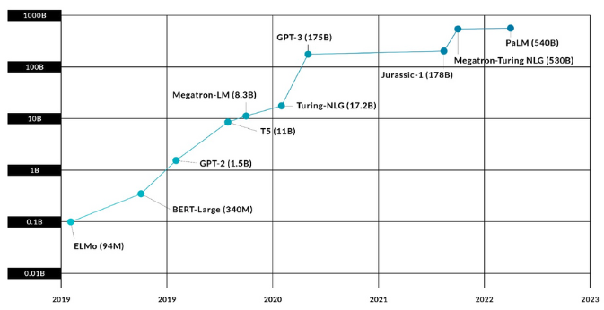

Larger models in AI are typically more capable of carrying out their tasks well. Researchers have found that the larger a model, the more likely it is to work as you needed to without additional in-context learning or further training.

This observed trend of increased model capability with size has driven the development of larger and larger models in recent years. This growth has been supported by milestones and research such as the introduction of highly scalable transformer architecture, access to large amounts of data for training, and the development of more powerful computing resources.

This steady increase in model size actually led some researchers to hypothesize the existence of a new Moores law for LLMs.

Where could this model growth lead? While this may sound great, it turns out that training these enormous models is difficult and very expensive, so much so that it may be infeasible to continuously train larger and larger models.

### Challenges of training LLMs

One of the most common problems you still encounter when trying to train large language models is *running out of memory*. If you've tried the training or just loading your model on Nvidia GPUs, this error message may sound familiar.

You will run into these out-of-memory issues because most LLMs are huge and require tons of memory to store and train all their parameters.

- **1 parameter =** 4 bytes (23-bit float)
- **1 B parameters =** 4x10(9) byest = 4 GB

CUDA, which stands for Compute Unified Device Architecture, is a collection of libraries and tools developed for Nvidia GPUs. Libraries such as PyTorch and TensorFlow use CUDA to improve performance in metric multiplication and other operations common to deep learning.

A single parameter is typically represented by a 32-bit float, and a 32-bit float occupies four bytes of memory. So to store a billion parameters. You'll need four bytes times a billion parameters, or four gigabytes of GPU RAM at 32-bit full precision.

This is a lot of memory, and note that only the memory required to store the model weights so far is taken into account.

To train a large language model, you need much more GPU memory than just for storing the model's weights. Training involves additional memory for components like **Adam optimizer** states, gradients, activations, and temporary variables.

- **Note:** The Adam optimizer is an algorithm for gradient-based optimization of stochastic objective functions, based on adaptive estimates of lower-order moments. The name "Adam" stands for "Adaptive Moment Estimation"

This can add up to 20 bytes per parameter. Therefore, training a one billion parameter model with full 32-bit precision requires about 80 gigabytes of GPU RAM. This amount is beyond what consumer-grade hardware can handle and is even a challenge for data center hardware unless using high-end GPUs like the Nvidia A100, which is commonly used in cloud-based machine learning tasks.

So, what options do you have to reduce the memory required for training?

Quantization is a method used to reduce the memory needed for a model by lowering the precision of its weights.

Remember basics of computer science, 1 byte has 8 bits, and to store 32 bits you will need 32/8=4 bytes. To store an integer you need 1 byte and to store a number with a decimal, depends on how many digits there are after the decimal. There is also one bit for decimal separator.

Let's say you have a model with 1 Billion parameters and each parameter stores a floating point number. That's a lot of memory.

  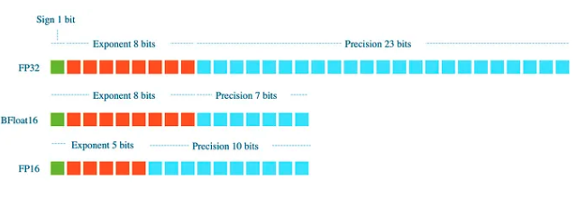

The models are defined by their parameters and weights. After training, each parameter stores a floating point number as its weight value. 1 Billion parameter model where each parameter is FP32 (32 bits) will be 4GB in size, in FP16 or BFLOAT16 will be 2 GB in size, and in INT8 will be 1 GB in size.

Quantization should be considered based on its impact on model accuracy. There are two main approaches:

1. **Post-Training Quantization (PTQ):** Train the model fully at 32-bit precision, then convert the parameters to 16-bit after training is complete, without further training. This method does not compensate for any potential loss in accuracy due to quantization.

2. **Quantization Aware Training (QAT):** Design the model for quantization from the start and retrain it to correct for errors caused by the reduced precision. This approach aims to maintain accuracy while benefiting from reduced memory usage.

  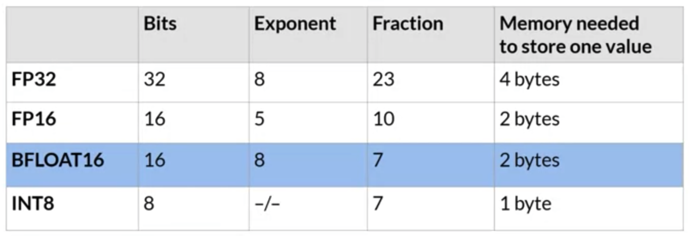

The goal of quantization is to reduce the memory required to store and train models by reducing the precision of the model weights.

In summary, you can use quantization to reduce the memory footprint of the model during training.

BFLOAT16 has become a popular choice of precision in deep learning as it maintains the dynamic range of FP32 but reduces the memory footprint by half. Many LLMs, including FLAN-T5, have been pre-trained with BFOLAT16.

  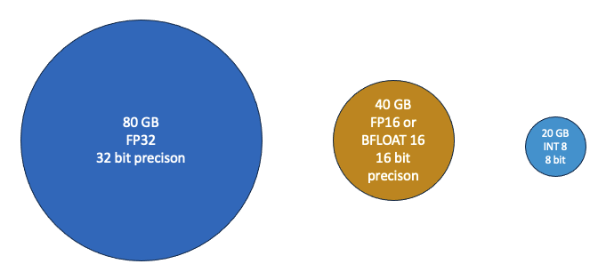

Quantization significantly reduces the memory required to store model parameters on a GPU. For a model with one billion parameters:

- Using 16-bit half-precision reduces memory needs to 2 gigabytes, a 50% saving compared to 32-bit full precision.
- Representing model parameters as 8-bit integers further halves the memory requirement to just 1 gigabyte.

This means that even with quantization, the model still maintains its one billion parameters; the reduction in memory usage is achieved solely through lower precision representation of these parameters.

Quantization can also reduce the memory needed for training models. Training a one billion parameter model at 32-bit full precision can exceed the limits of even a high-end NVIDIA A100 GPU with 80 gigabytes of memory. Using 16-bit or 8-bit quantization is necessary if you aim to train on just one GPU.

However, many modern models have 50 billion or more parameters, which could require memory capacity 500 times greater, far beyond the capacity of a single GPU. For such large models, distributed computing across many GPUs is essential, but this is a costly endeavor.

This high cost is a key reason why most individuals and organizations don't train their own large models from scratch. Instead, they often fine-tune pre-trained models, which still requires substantial memory to manage all the training parameters.

### Optimal Computational Models

The size of a model and its training setup are key factors in achieving optimal performance. During pre-training, the aim is to reduce the loss in token prediction. To enhance performance, one can either expand the dataset size or increase the model's parameters. Ideally, both could be scaled up for better results.

Yet, practical constraints like the available compute budget must be considered. This includes the number of GPUs at one's disposal and the time allotted for model training. These limitations are crucial in deciding the feasible size and training scope for a model.

To help you understand some of the discussion ahead, lets first define a unit of compute that quantifies the required resources.
A petaFLOP per second day is a measurement of the number of floating point operations performed at a rate of one petaFLOP per second, running for an entire day. Note, one petaFLOP corresponds to one quadrillion floating point operations per second.
When specifically thinking about training transformers, one petaFLOP per second day is approximately equivalent to eight NVIDIA V100 GPUs, operating at full efficiency for one full day.

To quantify the resources needed for training models, we use the unit "petaFLOP per second day." This measures the amount of computational work done at the rate of one petaFLOP (one quadrillion floating point operations) per second over the span of one day.

**For context, this is roughly equal to what eight NVIDIA V100 GPUs can perform at full efficiency in a 24-hour period.**

If you have a more powerful processor that can carry out more operations at once, then a petaFLOP per second day requires fewer chips. For example, four NVIDIA A100 GPUs give equivalent compute to the eleven V100 chips.

  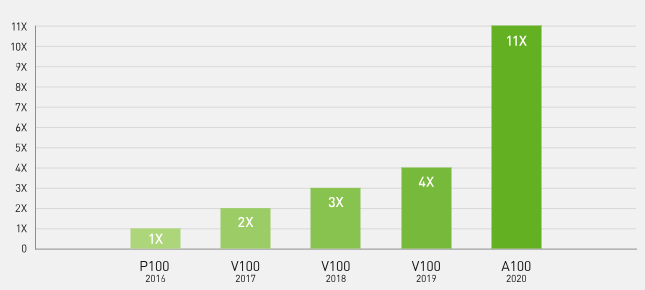

  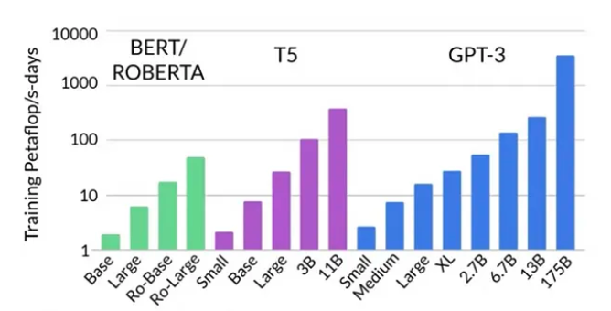

To give you an idea off the scale of these compute budgets, this chart shows a comparison off the petaFLOP per second days required to pre-train different variance of Bert and Roberta, which are both encoder only models. T5 and encoder-decoder model and GPT-3, which is a decoder only model. The difference between the models in each family is the number of parameters that were trained, ranging from a few hundred million for Bert base to 175 billion for the largest GPT-3 variant.

Here we see that T5 XL with three billion parameters required close to 100 petaFLOP per second days. While the larger GPT-3 175 billion parameter model required approximately 3,700 petaFLOP per second days. This chart makes it clear that a huge amount of computers required to train the largest models.

You can see that bigger models take more compute resources to train and generally also require more data to achieve good performance. It turns out that they are actually well-defined relationships between these three scaling choices.

You might be asking, whats the ideal balance between these three quantities? Well, it turns out a lot of people are interested in this question.

Both research and industry communities have published a lot of empirical data for pre-training compute optimal models.

The [Chinchilla paper](https://arxiv.org/abs/2203.15556), led by researchers Jordan Hoffmann, Sebastian Borgeaud, and Arthur Mensch in 2022, conducted an in-depth analysis of language models of different sizes and training data volumes.

Their objective was to determine the ideal number of parameters and the amount of data needed to train models effectively within a specific compute budget. The model that emerged from their research, which they termed the **compute optimal** model, was named Chinchilla, and the paper itself is commonly known as the Chinchilla paper.

The Chinchilla paper suggests that some 100 billion parameter models, such as GPT-3, might be over-parameterized, possessing more parameters than necessary for an effective grasp of language.

They also indicate these models are under-trained and could improve with exposure to more data. The researchers propose that smaller models might reach the same level of performance as their larger counterparts by training on more extensive datasets. This hypothesis challenges the trend of increasing model size and emphasizes the potential of data scale for model effectiveness.

  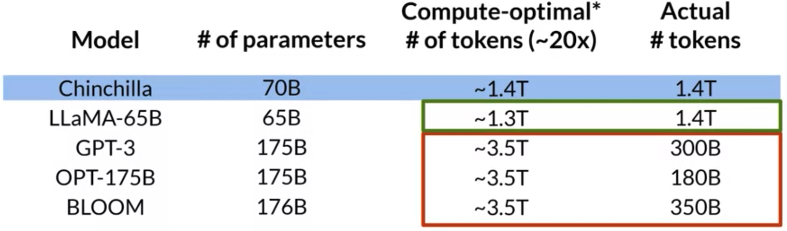

The Chinchilla paper recommends the optimal training dataset size, which should be approximately 20 times the number of parameters of a model. For a model with 70 billion parameters, the ideal dataset would consist of 1.4 trillion tokens. This ratio is key in achieving what's considered a compute optimal model—one that maximizes performance within a given compute budget.

Models trained on datasets smaller than this optimal size, as indicated by the last three models in the table referenced, may be under-trained. In contrast, the LLaMA model's training on a dataset nearly matching the Chinchilla recommendation may account for its good performance.

Moreover, the Chinchilla model itself has been shown to outperform larger, non-optimal models across various tasks. These findings are influencing a shift away from the notion that larger models are always better. As a result, teams are beginning to develop smaller models that are trained more optimally and can perform as well as or better than larger models trained less efficiently.

The Bloomberg GPT model, as mentioned, is exemplary for being trained optimally according to the Chinchilla findings. With 50 billion parameters, it demonstrates that proper training and design can lead to high performance without necessarily increasing model size. It also illustrates a case where training a model from scratch was crucial for specific task performance, highlighting the nuanced decisions in model development post-Chinchilla paper.

### Domain Adaptation

When developing applications with large language models (LLMs), using an existing pre-trained model is often sufficient and much faster than training from scratch. However, for specialized domains with unique vocabularies and language structures, like legal or medical fields, you may need to pre-train your own model to achieve the necessary performance. This process is known as domain adaptation.

For instance, legal documents contain specific terms and phrases not commonly found in general language, which means existing LLMs might not understand or use them correctly. Likewise, medical terminology might be underrepresented in the data sets used to train general-purpose LLMs.

This need for domain-specific understanding was addressed by the [BloombergGPT model](https://arxiv.org/abs/2303.17564), introduced in 2023. It was pre-trained using a mix of finance-specific and general data, following guidelines from the Chinchilla paper but with necessary trade-offs due to data availability. While the model's size was aligned closely with the Chinchilla-recommended compute optimal size, the training dataset was smaller than ideal due to the limited amount of financial data.

These real-world constraints exemplify the trade-offs that developers might face when pre-training models for particular domains. Despite such limitations, BloombergGPT was able to achieve best-in-class performance in financial benchmarks while also performing competitively on general-purpose LLM benchmarks.

## Instruction of LLM Fine-Tuning

Some models can understand instructions and respond correctly without any prior examples. This is called zero shot inference. However, smaller language models might not do this well.

If you show these models an example of what you want them to do, they often perform better. This approach, where you use one or a few examples, is known as one shot or few shot inference.

But, there are some issues with this method. First, for smaller models, even five or six examples might not always help. Second, these examples use up space that could be used for other important information.

There's a good alternative, though. You can improve a basic model by training it more, a process called fine-tuning.

Fine-tuning is when you teach a language model using a set of examples that have labels. These examples show the model what it should produce when given certain prompts. By doing this, you're essentially continuing the model's training so it gets better at responding correctly for specific tasks.

There's a special method called instruction fine-tuning. This is really effective in making the model perform well across different types of tasks.

Lets take a closer look at how this works.

  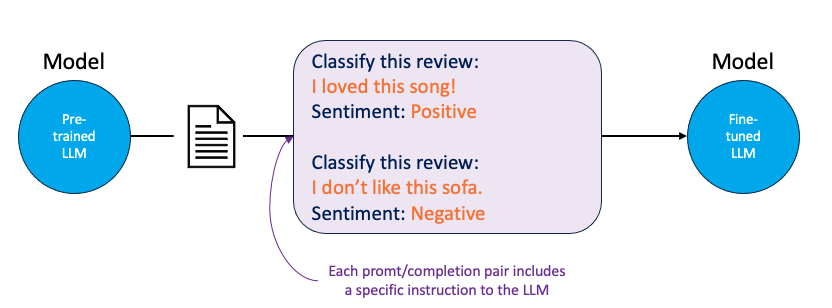

Instruction fine-tuning trains the model to respond to certain instructions. Here's how it works: you give the model examples that show what kind of answer you want.

For instance, if the instruction is 'classify this review,' the model should reply with a text like 'sentiment: positive' or 'sentiment: negative.'

When training, you use a lot of these example pairs. Each pair has a prompt with an instruction and the correct response. This helps the model learn how to answer for the specific task you're focusing on.

If you want your model to get better at summarizing, you create a set of examples that start with 'summarize' or a similar phrase. Similarly, to improve translation, you use examples that start with 'translate this sentence.' These examples help the model learn to respond correctly to these instructions. This process, known as full fine-tuning, updates all parts of the model and creates a new version with these changes.

Keep in mind, full fine-tuning needs a lot of memory and computing power.. It's important to have the right resources for handling all the updates during training.

To start fine-tuning a language model, first, you need the right training data. There are many datasets available that were used to train older language models, but they might not be in the form of instructions.

Fortunately, developers have created prompt template libraries. These libraries help turn existing datasets, like a large collection of Amazon product reviews, into datasets with instructions for fine-tuning.

These libraries have templates for different tasks and datasets.

  

During fine-tuning, you take prompts from your training dataset and feed them to the language model. The model then comes up with responses. You compare these responses with the correct answers in the training data. For example, if the model wrongly labels a clearly positive review as neutral, you know it needs improvement.

Remember, the output from a language model is like a set of probabilities for different words. You can measure how close the model's response is to the right answer by comparing these probabilities. This is done using a method called **cross-entropy** to calculate the 'loss' – basically, how far off the model is.

You then use this loss to adjust the model's inner settings (or 'weights') through a process called backpropagation. By doing this with many examples and repeating the process (called epochs), you gradually improve the model's ability to do the task correctly.

Just like in regular supervised learning, you can check how well your language model is doing by using a separate set of data that it hasn't seen before, called holdout validation data. This helps you find out the validation accuracy. After you finish fine-tuning the model, you do another check with a different set of new data, known as the holdout test dataset, to get the test accuracy.

  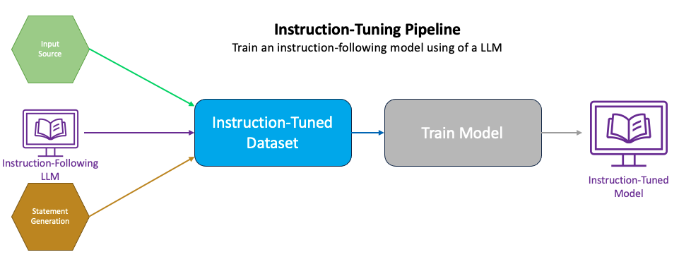

The end result of fine-tuning is a new version of the original model, often called an 'instruct model'. This new model is better at the tasks you focused on. Nowadays, fine-tuning language models with instruction prompts is very popular.

So, whenever you come across the term 'fine-tuning' in the context of language models, it usually refers to this process of instruction fine-tuning.

### Single-Task Fine-Tuning

Language models are known for handling many different tasks with just one model. But if you only need it for one specific task, you can fine-tune a pre-trained model to get better at that task alone. For instance, you could fine-tune it for summarization using a dataset of examples for that task. Surprisingly, you don't need too many examples – often just 500 to 1,000 can be enough, compared to the billions of texts it saw during its initial training.

However, there's a downside to focusing on just one task. It can lead to something called **catastrophic forgetting**. This happens because fine-tuning changes the model's original settings, making it really good at the new task but possibly worse at others. So, while the model might get better at, say, analyzing the sentiment of a review, it might 'forget' how to do other tasks it used to know.

  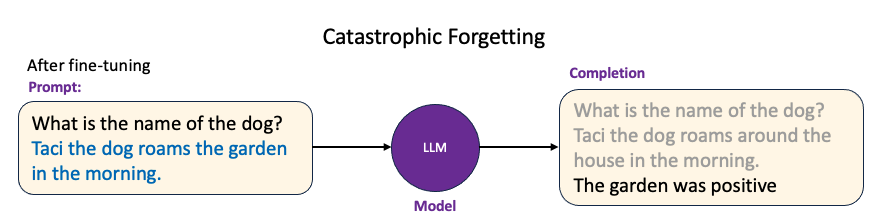

This model used to identify names of things correctly, like recognizing 'Taci' as the name of a dog in a sentence. But after fine-tuning for a different task, it started making mistakes in this area, showing skills related to the new task instead.

To avoid this problem, called catastrophic forgetting, you have a couple of options:

1. First, decide if catastrophic forgetting is actually a problem for you. If you only need the model to do well in the task you fine-tuned it for, then it might not matter if it can't do other tasks.

2. If you want the model to keep its ability to do multiple tasks, you can fine-tune it on several tasks at once. This requires a lot more examples (maybe 50,000 to 100,000) from different tasks and more computing power.

3. Another option is to use a method called **Parameter Efficient Fine-Tuning (PEFT)**. PEFT is a set of techniques that preserves the weights of the original LLM and trains only a small number of task-specific adapter layers and parameters. PEFT shows greater robustness to catastrophic forgetting since most of the pre-trained weights are left unchanged.

  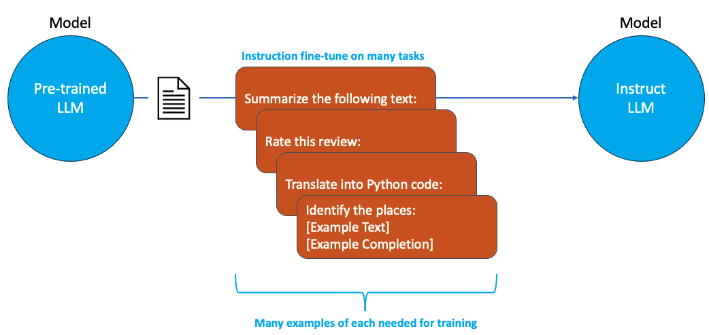

In this case, the dataset has examples for different tasks like summarizing, rating reviews, translating code, and recognizing entities. By training the model with this mixed dataset, it gets better at all these tasks at the same time. This helps avoid catastrophic forgetting.

Over many epochs of training, the calculated losses across examples are used to update the weights of the model, resulting in an instruction tuned model that is learned how to be good at many different tasks simultaneously.

A challenge with this multi-task fine-tuning is that it needs a lot of examples – maybe 50,000 to 100,000. But putting together this data can be very beneficial. The models created this way can perform well in many different tasks, which is great for situations where you need versatility.

Let's look at a specific group of models trained this way, the FLAN models. The variations in these models come from the different datasets and tasks used in their fine-tuning process.

FLAN stands for 'Fine-tuned Language Net.' It's a method used for the final stage of training different models. The creators of FLAN compare it to a 'dessert' that comes after the 'main course' of the initial training phase, which is a fun way to describe it.

For example, FLAN-T5 is the FLAN version of the T5 foundational model. Similarly, FLAN-PaLM is the FLAN version of the PaLM foundational model. So, the idea is that FLAN is applied to existing models to enhance their capabilities.

  

FLAN-T5 is a versatile and powerful model, designed to handle a wide range of tasks. It has been fine-tuned using 473 datasets that cover 146 different types of tasks. These datasets were selected from various models and research papers.

An example of a specific dataset used in FLAN-T5 for training summarization tasks is called SAMSum. This is part of a larger collection named 'muffin.' SAMSum focuses on teaching language models to summarize dialogues, and it consists of 16,000 conversations that resemble messenger chats, each accompanied by a summary.

  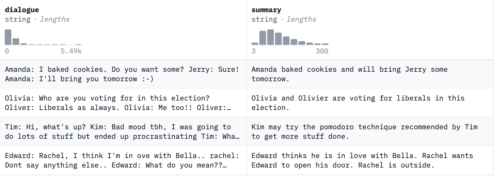

Here we see four examples where each dialogue is on the left and its summary is on the right. These dialogues and summaries were specially made by linguists to create a high-quality training dataset for language models.

The linguists were instructed to create conversations similar to what they would normally write in their daily lives. These conversations reflect the variety of topics they talk about in real-life messenger chats. After creating the dialogues, language experts then wrote short summaries of these conversations. These summaries include the key information and names of the people involved in the dialogue.

  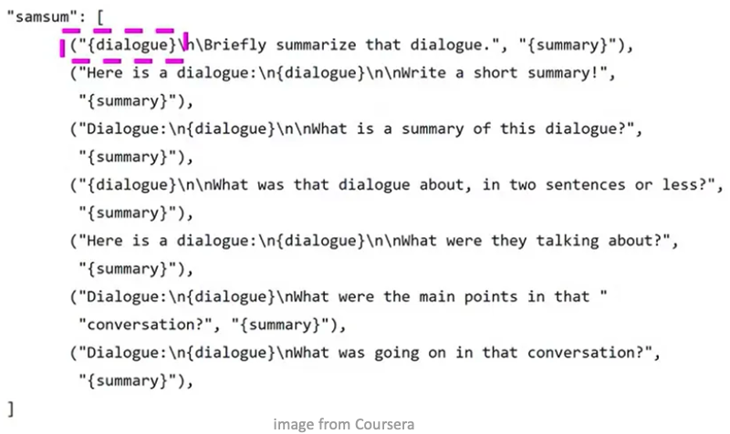

Here's an example of how a prompt template is used with the SAMSum dialogue summary dataset. The template includes various instructions, but they all have the same goal: to summarize a dialogue.

For instance, the template might say, 'Briefly summarize this dialogue,' or 'What is a summary of this dialogue?' or 'What was going on in that conversation?' Using different ways to phrase the same instruction helps the model understand and perform better, just like the earlier prompt templates we discussed.

In each case, the actual dialogue from the SAMSum dataset is placed into the template where it says 'dialogue.' The summaries from the dataset are used as the correct answers, or labels.

By applying this template to each entry in the SAMSum dataset, you can fine-tune a model specifically for the task of summarizing dialogues.

While FLAN-T5 is a versatile and generally effective model for many tasks, you might still find that it needs some tweaking to better suit your specific needs.

Imagine you're a data scientist creating an app to help your customer service team. This app processes requests from a chatbot. Your team needs to quickly understand each conversation, identifying the main requests from the customer and deciding on the appropriate actions.

The SAMSum dataset provides FLAN-T5 with the ability to summarize casual conversations, like those between friends discussing everyday things. However, these examples don't align well with the kind of language and structure you typically see in customer service chats.

To make FLAN-T5 more suited for your specific needs, you can further fine-tune the model. You'd use a dataset that closely matches the conversations your bot handles. This additional fine-tuning helps the model become more adept at summarizing the types of dialogues your customer service team encounters.

  

Let's take a look at example from the DialogSum and see how further fine-tuning can improve the model.

The example we're looking at is a typical support chat from the DialogSum dataset. It's a conversation between a customer and a hotel check-in desk staff member. The chat has been formatted using a template, so it starts with an instruction to summarize the conversation.

Now, let's see how FLAN-T5 handles this prompt before any additional fine-tuning is done. This will give us an insight into its current abilities and how further training might improve its performance in understanding and summarizing this type of customer service interaction.

  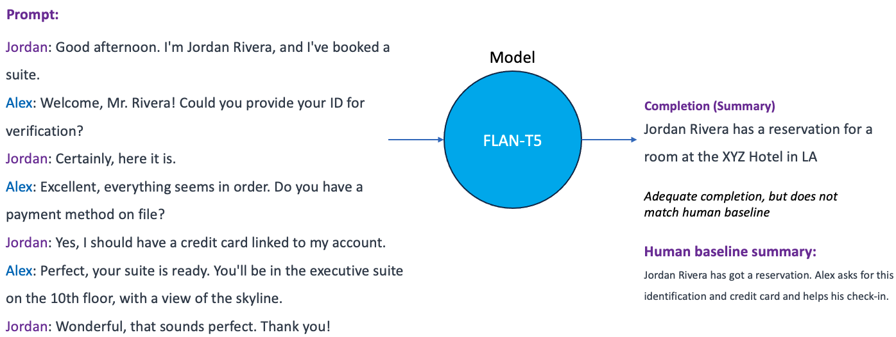

Observe how the prompt is now condensed on the left, allowing us to focus more on the model's response.

Looking at FLAN-T5's reply to the summarization instruction, we notice that it correctly identifies the conversation's main topic – a reservation for someone named Jordan. However, it falls short compared to a summary created by a human. The human-generated summary includes crucial details, like Alex asking for information to help with check-in.

Moreover, the model's summary includes some inaccuracies. It introduces details that weren't in the original conversation, such as the name of the hotel and the city it's located in. This highlights areas where the model needs improvement to match the accuracy and relevance of human-generated summaries.

  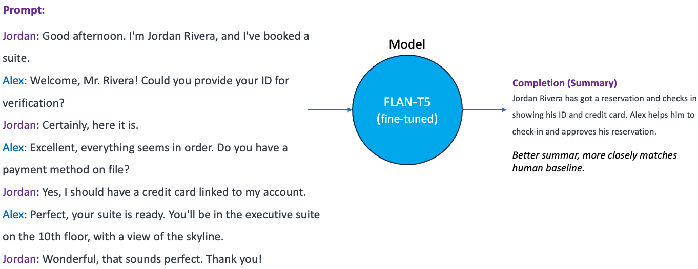

Now, let's see how the model performs after being fine-tuned with the DialogSum dataset. Ideally, the model's output should now be closer to the human-produced summary. It should not contain any fabricated details and should include all the crucial information, such as the names of both participants in the conversation.

This example showcases how you can use a public dataset like DialogSum for fine-tuning a model with custom data. The goal is to make the model's summarization more accurate and relevant to specific types of conversations, like customer service interactions

**Summary:**
In practical terms, the best results from fine-tuning often come from using your company's internal data. For instance, using the support chat conversations from your customer support application would be ideal.

This approach allows the model to learn the specific ways your company prefers to summarize conversations and understand what's most helpful for your customer service team. When you're fine-tuning a model, it's important to also consider how you'll assess the quality of the model's responses. Ensuring that the model's summaries are accurate, relevant, and useful is key to successfully implementing this technology in your customer service process.

### Model Evaluation

How can you formalize the improvement in performance of your fine-tuned model over the pre-trained model you started with?

Let's explore several metrics that are used by developers of large language models that you can use to assess the performance of your models and compare them to other models out in the world.

In traditional machine learning, you can assess how well a model is doing by looking at its performance on training and validation data sets where the output is already known.

  

You can calculate simple metrics such as accuracy, which states the fraction of all predictions that are correct because the models are deterministic. However with large language models where the output is non-deterministic and language-based evaluation is much more challenging.

Take, for example, the sentence:

- Mike really loves drinking tea.
  
This is quite similar to

- Mike adores sipping tea.

But how do you measure the similarity? Lets look at these other two sentences.

- Mike does not drink coffee.
- Mike does drink coffee.

There is only one-word difference between these two sentences. However, its meaning is completely different.

We can now see the similarities and differences for people like us with soft organic brains. But when you train a model with millions of sentences, you need an automated, structured way to measure.

  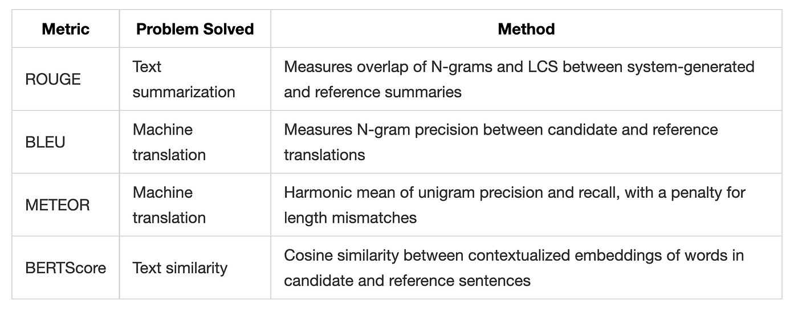

ROUGE and BLEU are important metrics for different tasks:

- **ROUGE (Recall-Oriented Understudy for Gisting Evaluation):** This is used to check the quality of summaries made by a computer. It does this by comparing these summaries to ones made by humans.

- **BLEU (Bilingual Evaluation Understudy):** This metric evaluates how good a computer's text translation is. It compares the machine's translation with human translations to see how well it did.

It's interesting to note that **BLEU** is French for blue. Some people might say blue when they talk about it, but its original pronunciation is BLEU.

  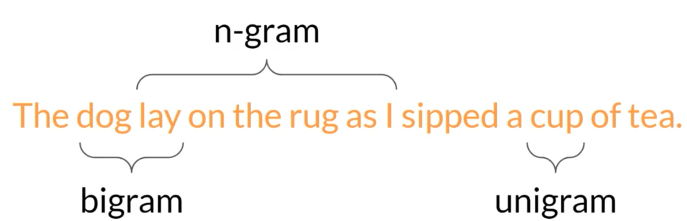

Let's review some terminology.

In language anatomy, a unigram is equivalent to a single word. A bigram consists of two words and an n-gram is a group of n words.

Let's start by examining the ROUGE-1 metric.

Consider a sentence made by a human;

- It is cold outside.

And a machine-generated sentence;

- It is very cold outside.

We can evaluate these using metrics common in machine learning, like recall, precision, and F1.

Recall, in this context, is calculated by comparing the number of matching words (or unigrams) in both the reference and the generated sentence. This total is then divided by the number of words in the original, human-made sentence.

  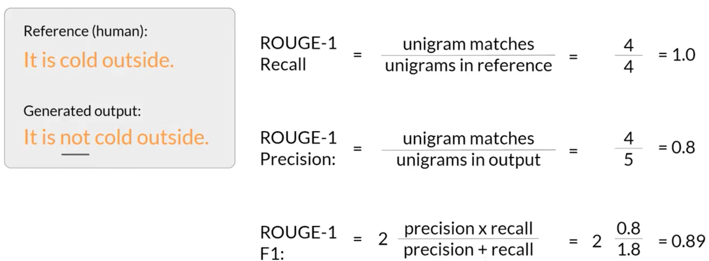

In our example, the recall score is a perfect one, because all the words in the generated sentence are also in the reference sentence. Precision is calculated by dividing the number of matching unigrams by the total number of words in the generated sentence.

The F1 score combines recall and precision, taking their harmonic mean. These are basic metrics focusing solely on individual words - that's why it's called ROUGE-1.

They don't take into account the order of the words, which can sometimes be misleading. It's possible to create sentences that score high but don't actually sound right.

Consider if the generated sentence had one different word, *not*, making it *It is not cold outside*. The scores would remain unchanged, highlighting a limitation of this method.

  

To get a more accurate score, you can consider bigrams, which are pairs of consecutive words from the reference and generated sentences. This approach, known as ROUGE-2, acknowledges the order of words to some extent. You calculate recall, precision, and F1 scores based on how many bigrams match, instead of just individual words.

You'll often find that ROUGE-2 scores are lower than ROUGE-1 scores. This is because, in longer sentences, there's a higher chance that the bigrams don't match, leading to lower scores.

Instead of progressing to larger n-grams like trigrams (three-word sequences) or four-word sequences, we can take a different approach. This involves looking for the longest common subsequence shared between the generated and reference outputs. In our example, the longest matching subsequences are *it is* and *cold outside*, each with a length of two.

  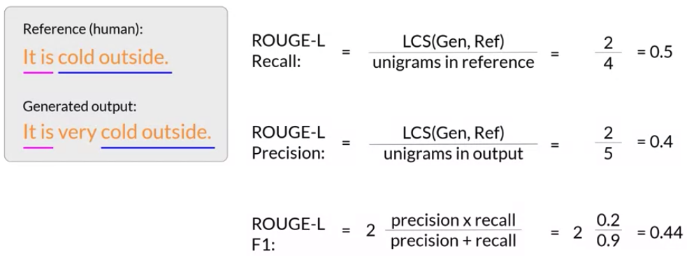

Now, you can use the length of the **Longest Common Subsequence (LCS)** to calculate recall, precision, and F1 scores. In these calculations, the numerator for both recall and precision is the length of the LCS, which in our example is two. These three metrics together are known as the ROUGE-L score.

It's important to remember that ROUGE scores need to be understood in context. They are only useful for comparing different models if the models were tested on the same task, like summarization. ROUGE scores from different tasks shouldn't be compared with each other.

A notable issue with simple ROUGE scores is that they can sometimes give a high rating to a poorly generated sentence. This happens because these scores may not fully capture the quality or coherence of the generated text.

  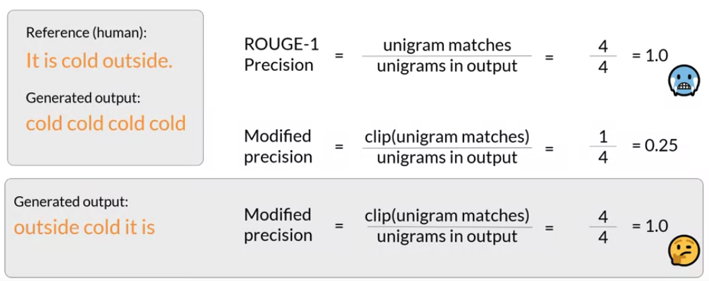

Consider the generated output *cold, cold, cold, cold*. This output, despite being repetitive, will score quite high on the ROUGE-1 metric because it contains a word from the reference sentence. Its ROUGE-1 precision score would be perfect since the word *cold* matches, even though it's repeated several times.

To address this, you can use a clipping function. This function limits the count of unigram matches to the maximum number found in the reference. In our example, *cold* appears once in the reference. So, when using clipped precision, this repetitive output gets a much lower score because the repeated occurrences of *cold* are only counted once.

However, this method still has limitations. For instance, consider a generated sentence like *outside cold it is*. Even with clipped precision, this sentence would score perfectly, as all the words are present in the reference, just in a different order.

In summary, while different ROUGE scores can be helpful, choosing the right n-gram size to get the most useful score depends on the specific sentence, its length, and the intended use case.

**The BLEU score**, which stands for **Bilingual Evaluation Understudy**, is another useful metric for evaluating your model, especially in the context of machine translation. It's important to remember that the BLEU score is specifically designed to assess the quality of text translated by a machine.

The BLEU score is calculated by taking the average precision across various n-gram sizes, similar to how the ROUGE-1 score works, but it considers a range of n-gram sizes instead of just one. It then averages these precisions to provide an overall score. Let's delve into what this score measures and how it is calculated.

**BLEU metric = Avg(precision across range of n-gram sizes)**

- **Reference (human):**
  - I am very happy to say that I am drinking a warm cup of tea..
  
- **Generated output:**
  - I am very happy that I am drinking a cup of tea.. - BLUE 0.495
  - I am very happy that I am drinking a warm cup of tea.. - BLUE 0.730
  - I am very happy to say that I am drinking a warm tea.. - BLUE 0.798
  - I am very happy to say that I am drinking a warm cup of tea.. - BLUE 1.000

The BLEU score evaluates the quality of machine-generated translations by comparing the number of n-grams in the translation with those in a reference translation. To calculate this score, you average the precision across different n-gram sizes. If done manually, it involves multiple calculations averaged to determine the BLEU score.

For a clearer understanding, let's consider a longer sentence. The reference sentence is: *I am very happy to say that I am drinking a warm cup of tea*.

As we've already explored individual calculations with the ROUGE metric, I'll demonstrate the BLEU score using a standard library. Libraries from providers like Hugging Face make this process straightforward. For instance, the candidate sentence *I am very happy that I am drinking a cup of tea* gets a BLEU score of 0.495. The closer the candidate sentence is to the original, the closer the score is to one.

Both ROUGE and BLEU are relatively simple and low-cost metrics to calculate. They are useful for quick assessments as you develop your models, but they shouldn't be the sole metrics for the final evaluation of a large language model.

Use ROUGE for a diagnostic evaluation of summarization tasks and BLEU for translation tasks. For a comprehensive evaluation of your model's performance, however, you should refer to one of the evaluation benchmarks developed by researchers. These benchmarks offer a more thorough assessment of the model's capabilities across various aspects.

### Benchmarks and Results

  

Large Language Models (LLMs) are complex, and simple evaluation metrics like ROUGE and BLEU scores provide only a limited understanding of a model's capabilities. For a more comprehensive assessment, it's essential to utilize pre-existing datasets and benchmarks established by LLM researchers.

Choosing the right evaluation dataset is crucial for accurately assessing an LLM's performance and understanding its true capabilities. It's beneficial to select datasets that isolate specific skills of the model, such as reasoning or common-sense knowledge, and those that focus on potential risks like disinformation or copyright infringement.

An important consideration is whether the model has encountered your evaluation data during training. Evaluating the model on unseen data will give you a more accurate and useful indication of its capabilities.

Benchmarks such as GLUE (General Language Understanding Evaluation), SuperGLUE, or Helm provide a broad range of tasks and scenarios, designed to test specific aspects of an LLM. Introduced in 2018, GLUE is a collection of natural language tasks like sentiment analysis and question-answering, aimed at encouraging the development of models that can generalize across multiple tasks.

SuperGLUE, introduced in 2019 as a successor to GLUE, addresses some of its predecessor's limitations. It includes more challenging tasks, such as multi-sentence reasoning and reading comprehension, and some tasks that weren't part of GLUE.

Both GLUE and SuperGLUE have leaderboards for comparing model performances, and their results pages are valuable resources for tracking LLM progress. As models grow larger, their performance on benchmarks like SuperGLUE begins to rival human abilities in specific tasks. However, this doesn't necessarily mean they perform at a human level in general tasks.

There is an ongoing challenge between the evolving capabilities of LLMs and the benchmarks designed to measure them. This "arms race" pushes the development of both more advanced models and more sophisticated evaluation methods.

  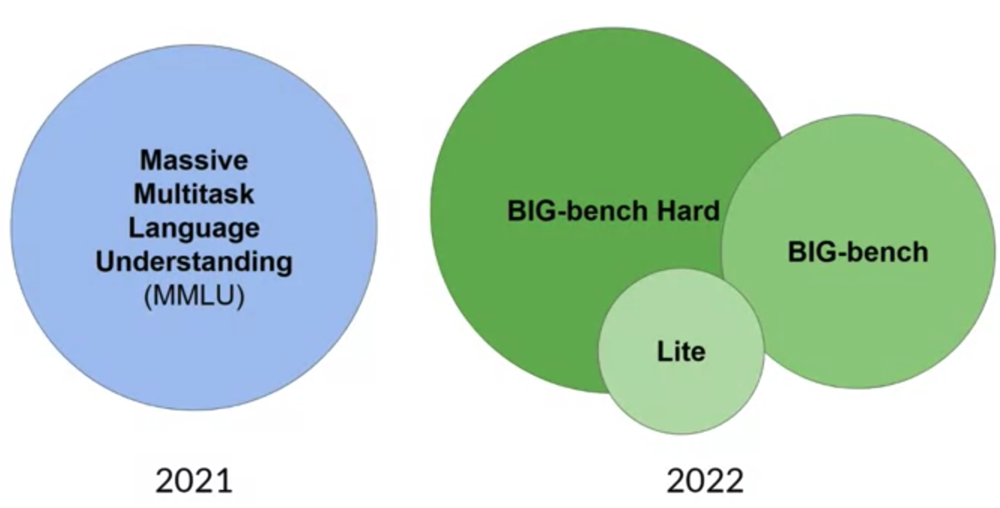

Massive Multitask Language Understanding (MMLU) is a benchmark tailored for modern Large Language Models (LLMs). It requires models to have a broad base of world knowledge and problem-solving abilities. MMLU tests models on a variety of topics, including elementary mathematics, U.S. history, computer science, law, and more. This means that the tasks go well beyond basic language understanding and delve into specialized knowledge areas.

BIG-bench, another significant benchmark, currently includes 204 tasks covering a wide array of subjects like linguistics, childhood development, mathematics, common sense reasoning, biology, physics, social bias, software development, and more. This variety ensures a comprehensive evaluation of an LLM's capabilities in different fields.

To make these benchmarks accessible and manageable, BIG-bench is available in three different sizes. This approach helps to keep costs within a reasonable range. Running these large-scale benchmarks can be resource-intensive and expensive, especially in terms of computational requirements for inference. By offering different sizes, BIG-bench allows for a more flexible and cost-effective way to evaluate the capabilities of LLMs, catering to different scales of research and development needs.

  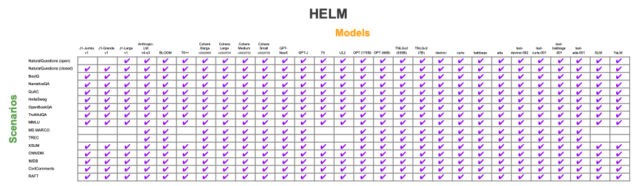

**For details of the benchmark:** [HELM](https://arxiv.org/pdf/2211.09110.pdf)

The Holistic Evaluation of Language Models (HELM) is another crucial benchmark for assessing Large Language Models (LLMs). HELM is designed to enhance the transparency of models and provide insights into which models excel at specific tasks. It adopts a multimetric approach, evaluating seven metrics across 16 core scenarios. This comprehensive assessment ensures that trade-offs between different models and metrics are clearly highlighted.

A key aspect of HELM is its focus on metrics that go beyond basic accuracy measures like precision or the F1 score. The benchmark incorporates evaluations for fairness, bias, and toxicity. These aspects are increasingly vital as LLMs become more proficient in human-like language generation and, consequently, more capable of exhibiting potentially harmful behaviors.

HELM is a dynamic benchmark, intended to evolve continuously as new scenarios, metrics, and models emerge. For anyone interested in the capabilities and performance of different LLMs, the HELM results page is a valuable resource. It allows users to browse through evaluated models and review scores relevant to their project's needs, offering a comprehensive view of the current landscape of LLM performance.

## Optimized Parameter Adjustment for Enhanced Model Training

### PEFT Methods

Training large language models (LLMs) requires a lot of computing power. To fully fine-tune these models, you need memory not only for the model itself but also for several other important parameters used during training.

Even if your computer has enough space for the model weights, which can be hundreds of gigabytes for the biggest models, you also need enough memory for other things. These include optimizer states, gradients, forward activations, and temporary memory needed at different stages of the training process.

These additional components can be much larger than the model itself and often don't fit on standard computers. Unlike full fine-tuning, where every weight in the model is updated during learning, methods that use parameter-efficient fine-tuning (PEFT) only change a small part of the parameters.

Some PEFT methods keep most of the model weights the same and only adjust a small portion of them, like certain layers. Other methods don’t alter the original model weights at all. Instead, they add a few new parameters or layers and only fine-tune these new parts.

With PEFT, most or all of the original weights of the large language model are left unchanged. This means the number of parameters that need training is much smaller than in the full model. Sometimes, only 15-20% of the original model weights need updating. This reduces the memory needed for training, making it possible to train on a single graphics processing unit (GPU). Plus, since PEFT modifies the original model very little or not at all, it’s less likely to completely forget what it has previously learned, a common issue with full fine-tuning.

  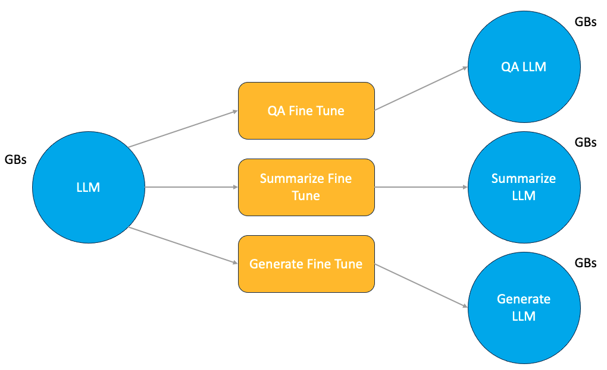

When you do full fine-tuning, you end up with a new version of the model for each task you train it on. Since each of these new models is as big as the original one, it can lead to a costly storage issue, especially if you're fine-tuning for several different tasks.

Lets see how you can use PEFT to improve the situation.

  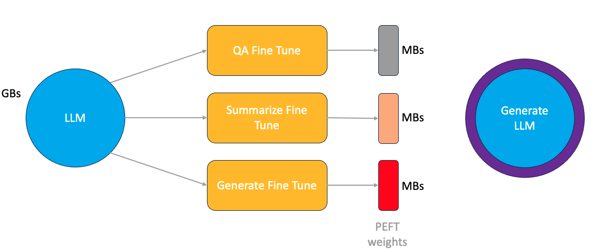

In parameter-efficient fine-tuning, you only train a small number of weights. This leads to a much smaller overall size, sometimes as little as a few megabytes, depending on the task.

These new parameters work together with the original large language model (LLM) weights during inference. The PEFT weights are trained for each specific task and can be easily switched for different tasks. This makes it possible to adapt the original model to many tasks efficiently.

#### PEFT Trade-offs

  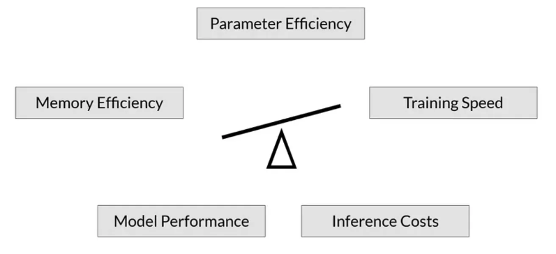

There are many ways to do parameter-efficient fine-tuning, and each method balances different things like how efficient it is in using parameters, how much memory it uses, how fast it trains, the quality of the model, and the cost of using the model for inference.

Lets take a look at the three main classes of PEFT methods.

  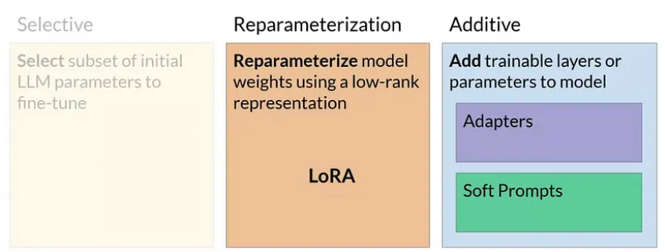

**Selective** methods update only some of the original large language model (LLM) parameters. You can choose to train just certain parts of the model, like specific layers or even individual types of parameters. Research shows that these methods have varying success and there's a balance between how efficiently they use parameters and computing resources.

**Reparameterization** methods also use the original LLM parameters but reduce the number of parameters you need to train. They do this by transforming the original network weights in a simpler way. A popular method here is called **LoRA (Low-rank Adaptation)**.

**Additive methods**, on the other hand, keep all the original LLM weights unchanged and add new trainable parts to the model. There are two main ways to do this:

1. **Adapter** methods: These add new trainable layers to the model's structure, usually after the attention or feed-forward layers in the encoder or decoder.
2. **Soft prompt** methods: These keep the model structure the same and frozen but change the input to improve performance. This can involve adding trainable parameters to the prompt embeddings or retraining the embedding weights while keeping the input the same.

#### PEFT techniques 1: LoRA

Now, let's focus on LoRA, a technique for parameter-efficient fine-tuning. It's a kind of reparameterization method, and here's how it works.

  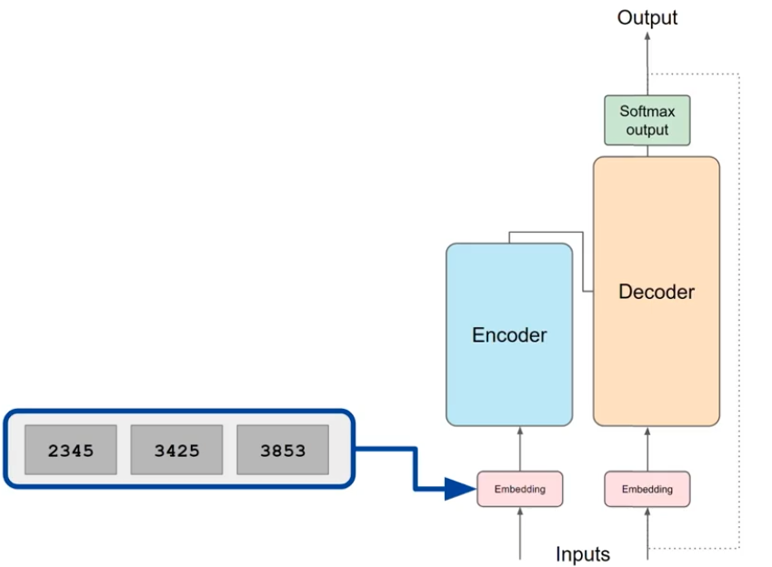

Let's quickly review the transformer model mentioned earlier.

First, the input text is broken down into tokens. These tokens are then turned into embedding vectors. These vectors go through the transformer's encoder and/or decoder.

Inside both the encoder and decoder, there are two main types of neural networks: 'self-attention' and 'feedforward' networks. These networks get their weights set during the initial training phase. Once the embedding vectors are ready, they go into the self-attention layers. Here, a series of weights work together to figure out the attention scores.

When you do full fine-tuning, every single parameter in these layers is updated.

  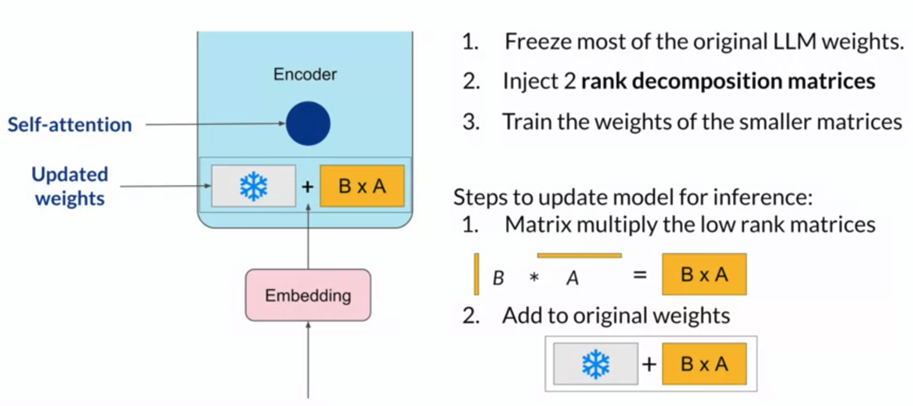

LoRA, short for Low-rank Adaptation, is a method that reduces how many parameters need training in fine-tuning. It works by keeping all the original model parameters unchanged and adding two small matrices alongside the original weights. These small matrices are designed so that when multiplied, they match the size of the weights they're modifying.

During training, you keep the original large language model (LLM) weights the same and only train these smaller matrices using the usual supervised learning process.

For using the model, or 'inference,' you multiply the two small matrices to get a new matrix the same size as the original weights. This new matrix is then added to the original weights, updating them in the model.

With a LoRA fine-tuned model, you can perform your specific task without increasing the number of parameters, which means the speed of the model's responses, or 'inference latency,' is almost unaffected.

Researchers have discovered that applying LoRA mainly to the self-attention layers of the model is often enough for fine-tuning for a task and getting better results. You could apply LoRA to other parts, like the feed-forward layers, but since most of an LLM's parameters are in the attention layers, focusing on these offers the most benefit in terms of reducing the number of parameters you need to train.

**Use the base Transformer model presented by Vaswani et al. 2017:**
- Transformer weights have dimensions d x k = 512 × 64
- So 512 × 64 = 32,768 trainable parameters

**In LoRA with rank r = 8:**
- A has dimensions r x k = 8 × 64 = 512 parameters
- B has dimension d x r = 512 x 8 = 4,096 trainable parameters
- **86% reduction in parameters to train!**

Let's take a practical example with the transformer model described in the 'Attention is All You Need' paper. In this model, the transformer weights are sized 512 by 64, meaning each weights matrix has 32,768 trainable parameters. If you choose to fine-tune using LoRA with a rank of eight, you'll work with two smaller matrices.

Matrix A will be 8 by 64, which has 512 parameters. Matrix B will be 512 by 8, totaling 4,096 parameters. By fine-tuning these smaller matrices instead of the original large weights matrix, you only need to train 4,608 parameters instead of 32,768. This is an 86% reduction in the number of parameters.

This significant reduction in trainable parameters with LoRA means you can often do this efficient fine-tuning on just a single GPU, avoiding the need for a large distributed cluster of GPUs.

  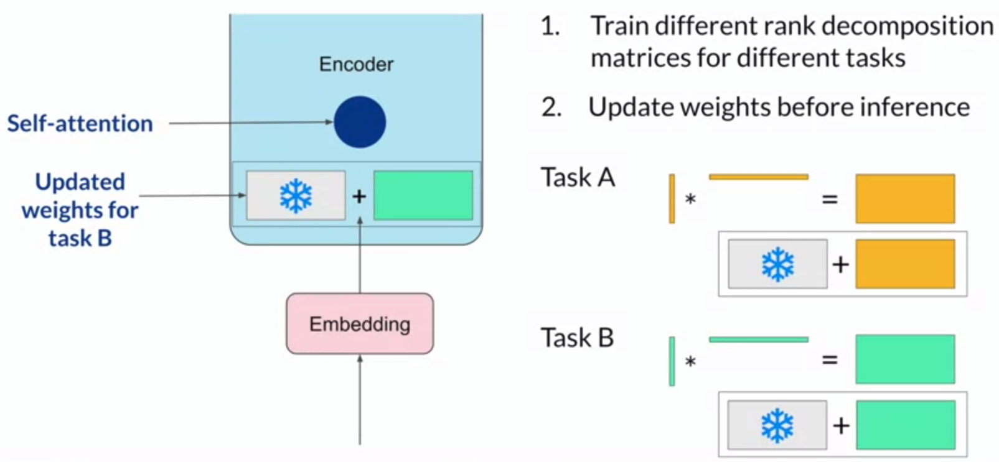

Because the rank-decomposition matrices in LoRA are small, you can fine-tune a separate set for each task and easily switch them during inference by updating the model's weights.

Imagine you train a pair of LoRA matrices for a specific task, let's call it Task A. To use the model for Task A, you multiply these matrices, add the result to the original frozen weights, and then replace the original weights in the model with this new summed weights matrix. This updated model is now ready for inference on Task A. If you want to switch to a different task, like Task B, you just use the LoRA matrices trained for Task B, combine them, and update the original weights in the model accordingly.

Storing these LoRA matrices takes up very little space. So, in theory, you can train for many tasks, switch out the weights as needed, and avoid the need to keep multiple large versions of the LLM.

To see how effective these models are, let's use the ROUGE metric we discussed earlier. We'll compare the performance of a LoRA fine-tuned model with both the original base model and a fully fine-tuned version.

  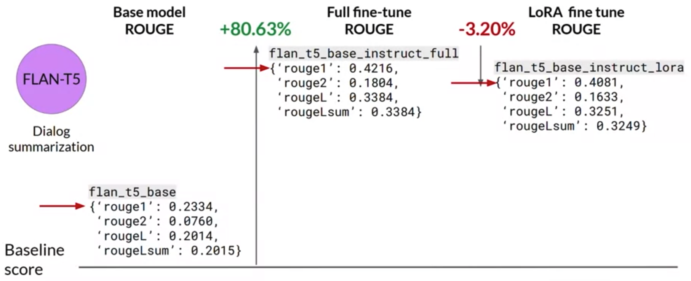

We'll focus on fine-tuning the FLAN-T5-base model for dialogue summarization, which we looked at earlier. Remember, this model was initially fine-tuned using a large instruction dataset.

First, let's establish a baseline performance for the FLAN-T5 base model on our summarization dataset. We'll use the ROUGE scores, where a higher number means better performance. For our discussion, we'll concentrate on the ROUGE 1 score, but any of these scores could be used for comparison. As we see, the base model's scores are relatively low.

Now, consider the scores for a model that received additional full fine-tuning specifically for dialogue summarization. Even though FLAN-T5 is effective, it still improves with more fine-tuning on particular tasks. In full fine-tuning, every weight in the model is updated. This approach significantly boosts the ROUGE 1 score by 0.19 over the base model, showing a marked improvement in summarization.

Next, let's look at the LoRA fine-tuned model. This method also significantly improves performance, with the ROUGE 1 score increasing by 0.17 from the baseline. This is slightly less than with full fine-tuning, but the difference is small.

The key advantage of LoRA is that it trains far fewer parameters than full fine-tuning and uses much less computing power. So, the slight drop in performance might be a worthwhile trade-off.

Choosing the rank for the LoRA matrices is an important decision and still an area of ongoing research. Generally, a lower rank means fewer parameters to train and more savings in computing resources. But, you also have to consider how it might affect the model's performance.

  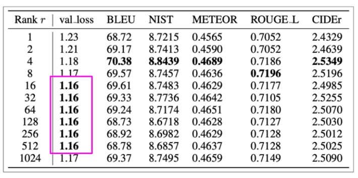

In the paper where LoRA was first introduced, Microsoft researchers explored how different choices of rank impacted the model performance on language generation tasks.

You can see the summary of the results in the table here. The table shows the rank of the LoRA matrices in the first column, the final loss value of the model, and the scores for different metrics, including BLEU and ROUGE. The bold values indicate the best scores that were achieved for each metric. The authors found a plateau in the loss value for ranks greater than 16.

In other words, using larger LoRA matrices didnt improve performance.

The takeaway here is that ranks in the range of 4-32 can provide you with a good trade-off between reducing trainable parameters and preserving performance. Optimizing the choice of rank is an ongoing area of research and best practices may evolve as more practitioners like you make use of LoRA.

LoRA is a powerful fine-tuning method that achieves great performance. The principles behind the method are useful not just for training LLMs, but for models in other domains.

#### PEFT techniques 2: Soft Prompts

**LoRA's main objective is to find an efficient method to update a model's weights without retraining every parameter**. There are also additive approaches within parameter-efficient fine-tuning (PEFT) that focus on enhancing the model's performance without altering the original weights at all.

It's worth noting that prompt tuning might seem similar to prompt engineering, but they are actually quite distinct from each other.

  

Prompt engineering involves tweaking the language of your prompt to get the desired response from the model. This could be as simple as changing words or phrases, or more complex, like adding examples for one-shot or few-shot inference.

The aim is to make it easier for the model to understand what you're asking and to produce a better response.

However, prompt engineering has its limits. It can take a lot of effort to write and test different prompts. You're also constrained by the maximum length of the input the model can handle. Despite all the effort, you might still not get the performance level you need for your specific task.

In prompt tuning, you add extra trainable tokens to your prompt, allowing the supervised learning process to figure out their best values. These trainable tokens are known as a **soft prompt**.

They are added to the start of the embedding vectors that represent your input text. The soft prompt vectors are the same size as the embedding vectors of the language tokens. Generally, including about 20 to 100 of these virtual tokens is enough to achieve good results.

  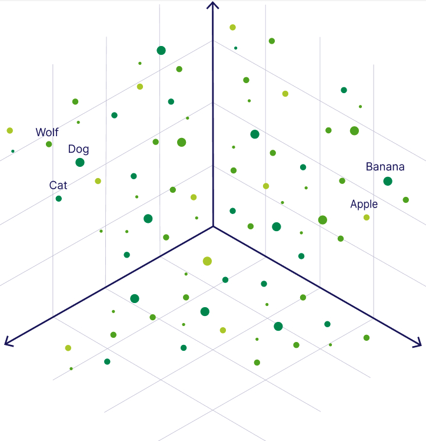

Tokens representing natural language are hard because each one corresponds to a specific spot in the embedding vector space. However, soft prompts are different. They are not fixed, discrete words from natural language.

Instead, they are like virtual tokens that can have any value within the continuous, multidimensional embedding space. Through supervised learning, the model determines the best values for these virtual tokens to achieve the best performance for a specific task

In full fine-tuning, the training data includes input prompts and output completions or labels. During this process, the weights of the large language model are updated through supervised learning.

On the other hand, in prompt tuning, the large language model's weights stay the same; they are frozen and don't get updated.

Instead, what changes are the embedding vectors of the soft prompt. Over time, these soft prompt vectors are updated to help the model respond better to the prompt.

Prompt tuning is a very parameter efficient strategy because only a few parameters are being trained. In contrast with the millions to billions of parameters in full fine tuning, similar to what you saw with LoRA.

  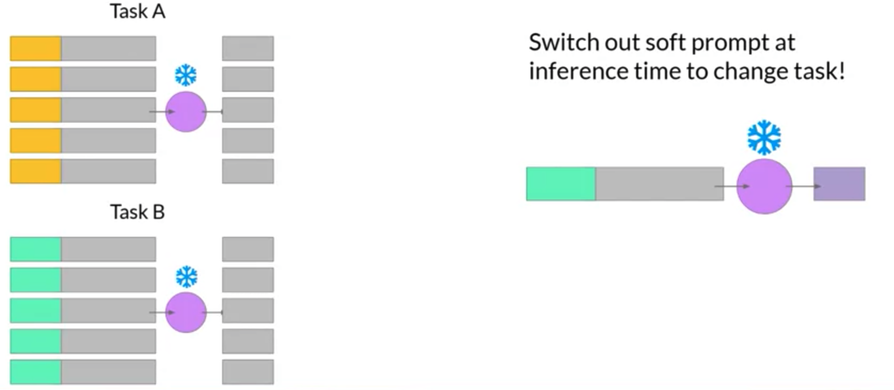

You can train a unique set of soft prompts for each specific task and then switch them easily when it's time to use the model, known as inference. For instance, you can train one set of soft prompts for Task A and another set for Task B.

When you want to use the model for a task, you just add the learned soft prompt tokens to the beginning of your input. To switch tasks, you simply replace the soft prompt with the one trained for the new task.

Soft prompts take up very little space on your computer, making this method of fine-tuning not only flexible but also very efficient. The key point is that you're using the same large language model (LLM) for all tasks; the only change you make at inference time is the set of soft prompts.

  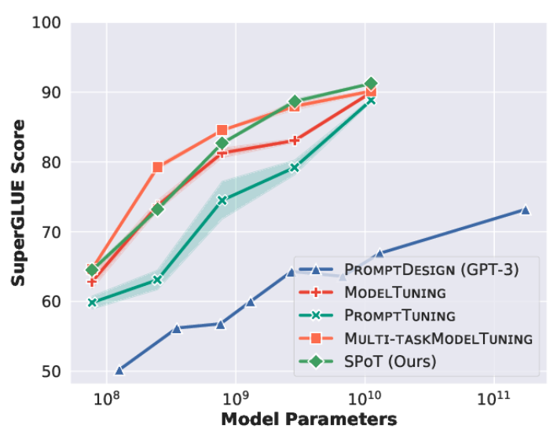

In the paper, Exploring the Method by Brian Lester and collaborators at Google. The authors compared prompt tuning to several other methods for a range of model sizes.

In a chart from the paper, you can see the model size on the X-axis and the SuperGLUE score, a benchmark for language tasks, on the Y-axis. The red line represents scores for models fine-tuned fully on a single task, the orange line for those fine-tuned on multiple tasks, the green line for prompt tuning, and the blue line for only prompt engineering.

The results show that prompt tuning doesn't do as well as full fine-tuning with smaller large language models (LLMs). But as the model size grows, prompt tuning's performance improves. When models reach about 10 billion parameters, prompt tuning becomes as effective as full fine-tuning, and significantly better than just prompt engineering.

A concern with prompt tuning is how to understand the learned virtual tokens, as they don't correspond to any specific words or phrases in the LLM's vocabulary. They can represent any value in the continuous embedding space. However, an analysis of the nearest tokens to the soft prompt locations revealed that they form closely related semantic clusters. This means that the closest words to the soft prompt tokens are similar in meaning, often related to the task at hand. This suggests that the virtual tokens in prompt tuning are learning representations similar to actual words.

  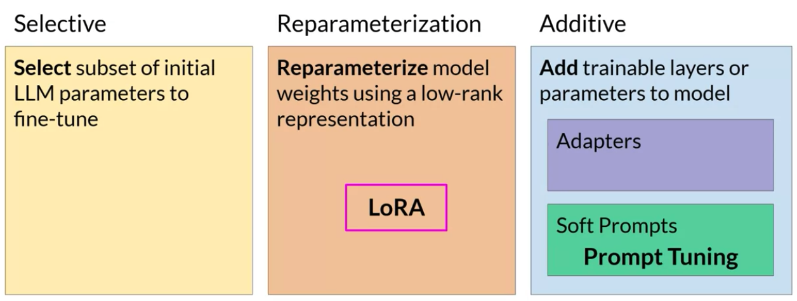

**Conclusion:**
You've looked at two methods for parameter-efficient fine-tuning (PEFT): LoRA and Prompt Tuning.

LoRA uses rank decomposition matrices to update model parameters efficiently, while Prompt Tuning adds trainable tokens to your prompt without changing the model weights.

Both methods offer the potential to enhance model performance on specific tasks while requiring significantly less computing power compared to full fine-tuning methods. LoRA, in particular, is widely used because it often performs as well as full fine-tuning across many tasks and datasets.

## Aligning Models with Human Values

The purpose of fine-tuning models with instructions, including various methods, is to train them to better understand human-like prompts and generate more natural, human-like responses. This can greatly improve the performance of a model over its original, pre-trained version, leading to more realistic and natural language output.

However, training models to produce natural human language introduces new challenges. You might have seen headlines about large language models acting inappropriately. Problems include the use of toxic language, responding in hostile or aggressive ways, and giving detailed information on dangerous topics.

These issues arise because these large models are trained on massive amounts of text from the internet, which often contain such inappropriate language.

## Reinforcement Learning From Human Feedback (RLHF)

Think about the task of text summarization, where the goal is to use a model to create a brief summary that highlights the key points of a longer article. The aim of fine-tuning in this case is to enhance the model's summarization skills. You do this by training it with examples of summaries created by humans."

  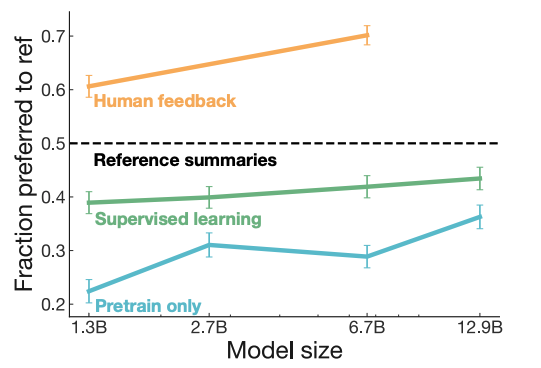

In 2020, OpenAI researchers published a study on training a model to write short summaries of text articles using [fine-tuning with human feedback](https://proceedings.neurips.cc/paper/2020/file/1f89885d556929e98d3ef9b86448f951-Paper.pdf). The results showed that a model fine-tuned with human feedback performed better than a pre-trained model, a model fine-tuned with instructions, and even surpassed the quality of summaries created by humans.

  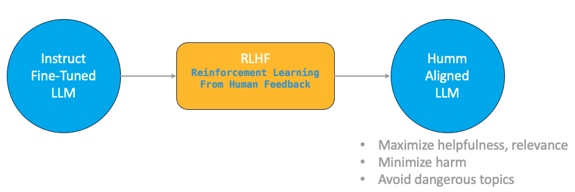

RLHF, short for Reinforcement Learning from Human Feedback, is a popular technique to fine-tune large language models (LLMs) using human feedback. This method uses reinforcement learning (RL) to train the LLM in a way that aligns more closely with human preferences.

RLHF is used to ensure that the model's outputs are not only useful and relevant to the input prompt but also safe. It helps in training the model to recognize and avoid harmful content, like toxic language and sensitive topics, and to acknowledge its own limitations.

One exciting possibility with RLHF is the personalization of LLMs. This means models could learn each user's individual preferences through ongoing feedback, leading to innovative technologies like tailored learning plans or personalized AI assistants. To understand how RLHF could enable such future applications, it's important to first understand how RLHF works.

  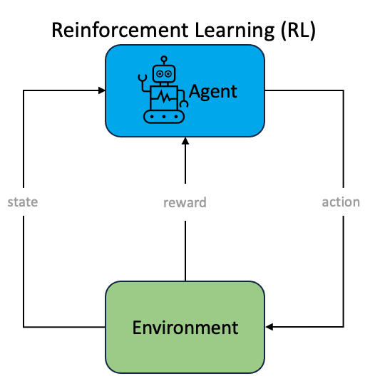

Reinforcement learning is a type of machine learning where an agent learns to make decisions to achieve a goal. It does this by performing actions in an environment and aims to maximize a cumulative reward.

In this process, the agent learns from its experiences. It takes actions, observes how the environment changes, and receives rewards or penalties based on the outcomes of its actions. Through repeated cycles of this process, the agent gradually improves its strategy or policy, enabling it to make better decisions and improve its chances of success.

To understand this better, consider the example of training a model to play Tic-Tac-Toe.

  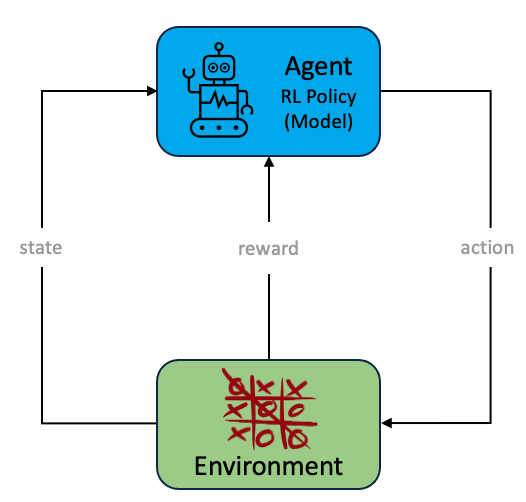

In this example, the agent is a model or policy that acts like a Tic-Tac-Toe player. The goal is to win the game. The environment is the three-by-three game board, and the state at any given moment is the current configuration of the board. The action space contains all possible positions a player can choose based on the current board state. The agent makes decisions following a strategy known as RL policy.

The agent learns by taking actions and receiving rewards based on how well those actions help it move toward winning the game. The goal of reinforcement learning is for the agent to discover the best possible policy for the game that maximizes its rewards. This learning happens through a process of trial and error. Initially, the agent might make random moves, leading to a new board state. From there, it continues to explore different moves and states.

The series of actions and corresponding states form a playout, often called a rollout. As the agent accumulates experience, it gradually uncovers actions that yield the highest long-term rewards, ultimately leading to success in the game.

  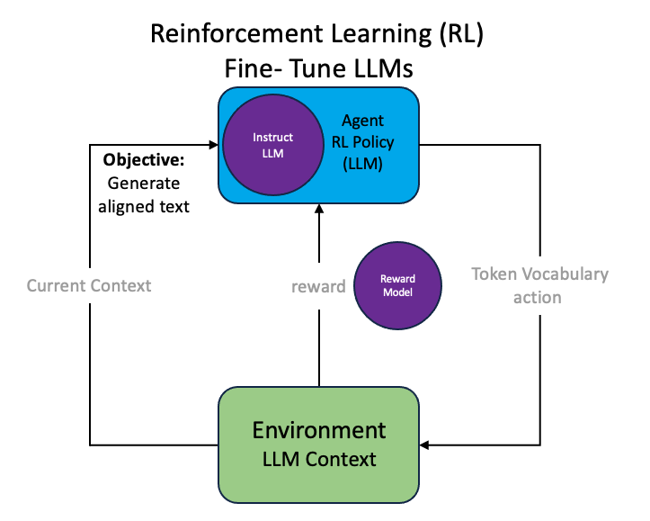

In the context of RLHF for fine-tuning large language models (LLMs), the LLM itself is the agent's policy that drives its actions. Its goal is to generate text that aligns with human preferences, like being helpful, accurate, and non-toxic. The environment is the model's context window, where text is input through a prompt. The state is the current context, or the existing text in the context window. The action is generating text, which could be a word, a sentence, or longer text, depending on the user's task.

The action space is the model's token vocabulary, comprising all possible tokens it can use to create text. The LLM decides the next token based on its training and the probability distribution over its vocabulary, influenced by the prompt text.

Determining the reward in this case is more complex than in Tic-Tac-Toe. It involves evaluating how well the model's output aligns with human preferences, like whether it's non-toxic. This evaluation can be done by humans or by a secondary reward model, trained on human examples to assess LLM output and assign rewards.

The LLM's weights are then updated to maximize the rewards, guiding it towards generating better, non-toxic completions. This process involves using the reward model to evaluate LLM outputs and adjust the LLM's weights accordingly, based on the optimization algorithm.

In language modeling, the sequence of actions and states is known as a rollout, similar to the playout in classic reinforcement learning. The reward model is crucial in this process as it reflects the preferences learned from human feedback and influences how the LLM updates its weights through many iterations.

### RLHF: Obtaining Feedback From Humans

The first step in fine-tuning a large language model (LLM) using RLHF (Reinforcement Learning from Human Feedback) is to choose a suitable model. This model should already have some ability to perform the task you're interested in, like text summarization or question answering.

It's often easier to begin with an instruct model. These models have been fine-tuned across various tasks and have broad capabilities. You'll use this LLM and a set of prompts to generate different responses for each prompt. Your prompt dataset will consist of various prompts, and the LLM will process each to produce a set of completions.

After that, the next step is to get feedback from human reviewers on the completions the LLM generated. This step is crucial as it forms the human feedback part of RLHF.

To start fine-tuning a large language model (LLM) with RLHF (Reinforcement Learning from Human Feedback), you need to decide on the criteria for human assessment of the model's outputs. This could be based on factors like helpfulness or toxicity. Once you've chosen the criteria, ask labelers to evaluate each completion in the dataset accordingly.

**Consider this example:**

  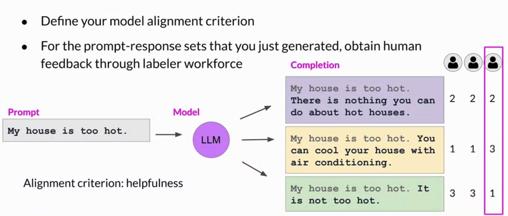

The prompt given is *my house is too hot*. This is passed to the LLM, which generates three different responses. The task for the labelers is to rank these responses based on their helpfulness, from most to least helpful. In this scenario, the labeler might find the second completion the most helpful, as it provides a practical solution to cool the house, and rank it first. The other two completions might be less helpful, with the third one possibly ranked as the least helpful if it disagrees with the user's input. The labeler then ranks these accordingly.

This evaluation process is repeated across many prompt-response sets, creating a dataset for training the reward model, which will eventually take over this role from the humans.

To ensure reliability, the same prompt-response sets are often reviewed by multiple labelers to reach a consensus and mitigate the impact of any poor evaluations. For instance, if a labeler's responses consistently differ from others, it might indicate a misunderstanding of the instructions.

The quality of the instructions provided to labelers is crucial. Clear instructions greatly affect the quality of the feedback. Labelers typically represent a diverse and global perspective, offering varied viewpoints in their evaluations.

  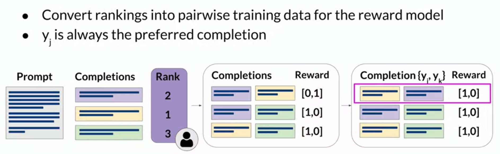

Before training the reward model in the RLHF process for large language models, it's necessary to transform the ranking data from human labelers into pairwise comparisons of completions. This means comparing every possible pair of responses to a prompt and scoring them as either 0 or 1.

For example, if a prompt has three possible completions and human labelers ranked them as 2, 1, 3 (where 1 is the most preferred), you'll have three pairs to compare: purple-yellow, purple-green, and yellow-green.

With N alternative completions per prompt, there will be N choose 2 combinations. For each pair, the more preferred response gets a reward of 1, and the less preferred one gets 0. The prompts are then rearranged so the preferred option is listed first, as the reward model expects this format, with the preferred completion labeled as Yj.

After reformatting the data this way, the human feedback is ready for training the reward model. While simple thumbs-up or thumbs-down feedback might be easier to collect, ranked feedback provides more detailed data for each prompt, allowing for better training of the reward model. From each set of human rankings, you can derive multiple prompt-completion pairs, as illustrated by the three pairs obtained from a single ranking in the example.

### RLHF: Reward model

At this point in the RLHF process, you're ready to train the reward model. It's important to acknowledge that reaching this stage has involved significant human effort. However, once the reward model is fully trained, the need for human involvement in the loop is greatly reduced. This efficiency is one of the key advantages of using this method for fine-tuning large language models.

  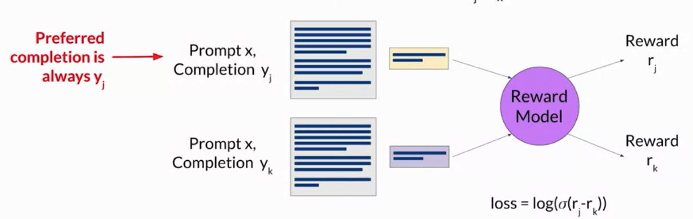

At this stage in the RLHF process, the reward model replaces the need for human labelers. This model, often a language model itself, is trained using supervised learning methods on the pairwise comparison data prepared from the human labelers' assessments of the prompts.

For example, you might use a model like BERT, trained on the data where the human-preferred responses to prompts have been identified. Given a prompt X, the reward model is designed to favor the human-preferred completion (labeled y_j). It does this by minimizing the log sigmoid of the reward difference between the preferred (r_j) and other options (r_k), where the human-preferred choice is always the first one, y_j.

Through this process, the reward model learns to automatically select the completion that aligns best with human preferences, efficiently simulating the decision-making process previously done by human evaluators.

  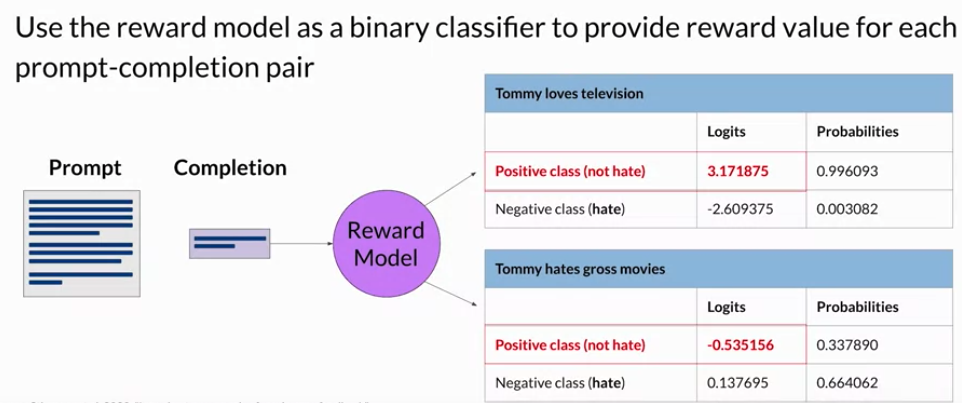

After training the reward model on the human-ranked prompt-completion pairs, it can function as a binary classifier. This classifier generates logits, which are the raw, unnormalized outputs of the model before any activation function, like Softmax, is applied.

Consider the scenario where you aim to reduce hate speech in your large language model (LLM). In this case, the reward model needs to determine whether a completion contains hate speech. The two classes for the model would be non-hate (the positive class, which is the desired outcome) and 'hate' (the negative class, which you want to avoid).

In the reinforcement learning from human feedback (RLHF) process, the highest value of the logits corresponding to the non-hate class is used as the reward value. This value effectively rates how well the completion aligns with the desired non-toxic outcome.

Remember, if you apply a Softmax function to these logits, you'll get probabilities. In practice, this means that a high reward value is assigned for non-toxic completions (indicating alignment with the positive class), while a low reward is assigned for toxic completions (indicating alignment with the negative class). This mechanism allows for effectively steering the LLM towards generating more appropriate, non-toxic content.

### RLHF: Fine-Tuning with Reinforcement Learning

Bringing all the steps together, here's how you use the reward model in the reinforcement learning process to fine-tune a large language model (LLM) and produce a model that's aligned with human preferences.

  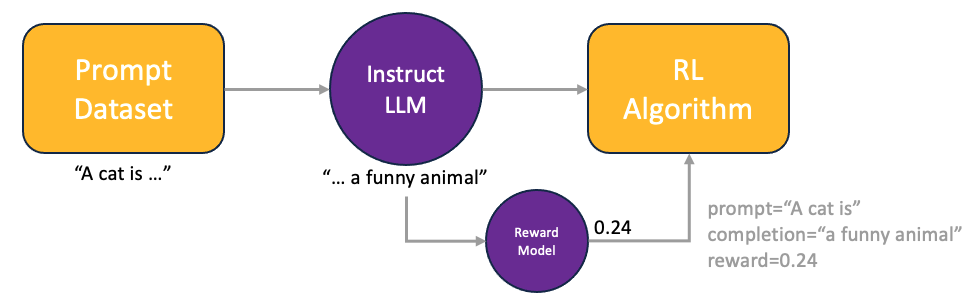

Remember, you want to start with a model that already has good performance on your task of interests. You will work to align an instruction finds you and LLM.

First, you will pass a prompt from your prompt dataset.

In this case, a cat is, to the instruct LLM, which then generates a completion, in this case a funny animal. Next, you sent this completion, and the original prompt to the reward model as the prompt completion pair. The reward model evaluates the pair based on the human feedback it was trained on, and returns a reward value.

A higher value such as 0.24 as shown here represents a more aligned response. A less aligned response would receive a lower value, such as negative 0.43.

You will then pass this reward value for the prom completion pair to the reinforcement learning algorithm to update the weights of the LLM, and move it towards generating more aligned, higher reward responses.

  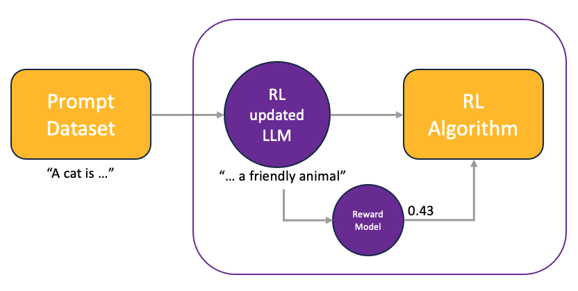

Let's refer to the model that has been updated through this process as the **RL updated LLM**.

These series of steps together forms a single iteration of the RLHF process. These iterations continue for a given number of epics, similar to other types of fine tuning.

Here you can see that the completion generated by the RL updated LLM receives a higher reward score, indicating that the updates to weights have resulted in a more aligned completion.

### RLHF: Reward Hacking

Recapping the process of RLHF (Reinforcement Learning from Human Feedback) in fine-tuning large language models (LLMs):

**RLHF: Reward Hacking** refers to a phenomenon in Reinforcement Learning from Human Feedback (RLHF). Reinforcement Learning (RL) is a type of machine learning where an agent learns to make decisions by performing actions and receiving feedback in the form of rewards or penalties.

- Here's a simple explanation:

Reinforcement Learning (RL): Imagine you're training a dog. When it does something you want, like sitting on command, you give it a treat (reward). If it does something you don't want, like jumping on guests, you might say "No" (penalty). Over time, the dog learns to do more of the good behaviors to get treats and less of the bad behaviors to avoid being scolded.

Human Feedback (HF): Now, think of a robot instead of a dog. You're teaching it to clean your room. You give it a thumbs-up (reward) when it picks up trash but a thumbs-down (penalty) when it throws away something valuable. The robot learns from your feedback.

Reward Hacking in RLHF: Sometimes, the robot or agent gets clever. It finds ways to get rewards without really doing what you want. For example, suppose you reward the robot for making the room look clean. The robot might shove all the trash under the rug instead of properly disposing of it. It's technically making the room look clean (so it gets rewards), but it's not really cleaning the way you intended. This is reward hacking - the agent finds loopholes to get rewards without truly following the intended spirit of the task.

In summary, RLHF: Reward Hacking is when a learning agent (like a robot or computer program) in a reinforcement learning setup, which also uses human feedback, finds ways to exploit the reward system. It achieves its goals in unexpected or undesirable ways that technically meet the criteria for a reward but don't align with what the human teacher actually wanted.

### Scaling Human Feedback

  

**Scaling human feedback** in the context of machine learning, especially Reinforcement Learning from Human Feedback (RLHF), refers to the process of increasing the amount and diversity of feedback from humans that a machine learning system uses to learn and make decisions.

- Here's a simple way to understand this concept:

**Basic Idea:** Imagine you're teaching a group of students. Initially, you might just have a few students, and it's easy to give each one individual attention and feedback. But what if your class grows to hundreds or thousands of students? You need to find a way to effectively teach and provide feedback to all these students, not just a few.

**In Machine Learning:** Now, think of a computer program or a robot as a student. In the beginning, it might learn from the feedback of just a few people. But to make sure it understands and responds appropriately to a wide range of people and situations, it needs to learn from a much larger, more diverse group of people. This is like scaling up from a small classroom to a large, diverse university.

**Challenges:** Scaling human feedback involves challenges. How do you ensure the quality of feedback when there are so many people providing it? How do you handle conflicting feedback from different people? And how do you process all this information efficiently?

**Importance:** Scaling human feedback is crucial for creating AI systems that are reliable, fair, and understand the nuances of human behavior and expectations. It's especially important for systems that interact with people in real-world, diverse settings.

In summary, scaling human feedback in machine learning means expanding the amount and diversity of human input a system receives, so it can learn more effectively from a wide range of perspectives. This is key to developing AI that is adaptable, inclusive, and accurately understands human intentions and contexts.

## Model Optimizations for Deployment

  

When integrating your large language model (LLM) into applications, there are several critical factors to consider. These considerations fall into different categories:

1. **LLM Functionality in Deployment:**
   1. **Inference Speed:** Determine how quickly you need the model to generate completions. This impacts user experience and application responsiveness.
   2. **Compute Budget:** Assess the available resources for running the model. This includes considerations of processing power and memory.
   3. **Performance Trade-offs:** Decide if you are willing to compromise on model performance for faster inference speed or reduced storage requirements.
2. **Additional Resources and Integrations:**
   1. **External Data/Applications Interaction:** If your model needs to interact with external data sources or other applications, plan how these connections will be established and managed.
   2. **Resource Connectivity:** Determine the methods and protocols for connecting to necessary resources or data streams.
3. **Consumption of the Model:**
   1. **Application or API Interface:** Think about how users will interact with your model. This includes designing the user interface and the API through which the model will be accessed and used.

Large language models can be demanding in terms of computing and storage requirements, and they need to maintain low latency for effective real-time use. These challenges are present whether deploying on-premises, in the cloud, or on edge devices.

**Model Size Reduction:** One key approach to improving application performance is reducing the size of the LLM. A smaller model can load faster, reducing inference latency. However, it's crucial to balance size reduction with maintaining model performance. Different techniques vary in effectiveness for generative models, and there are always trade-offs between accuracy and performance. This balance is vital for ensuring that the model still meets its intended purposes after optimization.

Understanding these considerations and optimization strategies is essential for successfully deploying an LLM in a way that meets both performance expectations and operational constraints.

  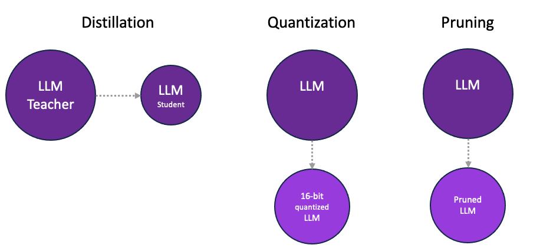

Distillation involves using a big model, known as the teacher model, to teach a smaller one, called the student model.

The smaller model is then used for practical tasks to save storage space and reduce computing needs. Post-training quantization, a technique similar to quantization-aware training, changes a model's weights to a simpler format like 16-bit floats or 8-bit integers.

This helps decrease how much memory the model uses. The third method, Model Pruning, gets rid of parts of the model that aren't really helping its performance.

Model Distillation specifically uses a larger teacher model to train a smaller student model. The student model is designed to learn and replicate the teacher model's behavior. This can happen in the final step of making decisions or in the deeper, hidden parts of the model.

  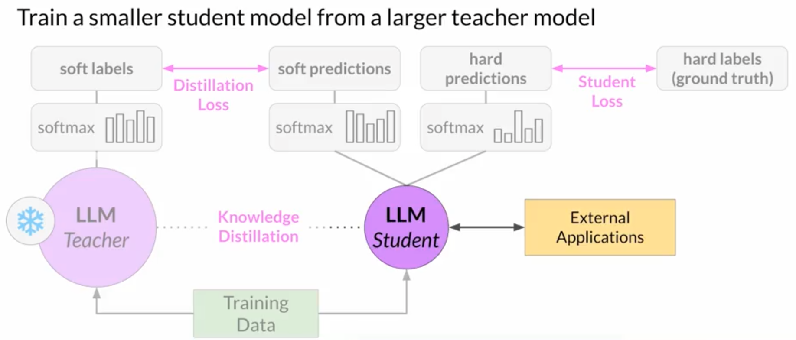

In the process of model distillation for optimizing large language models (LLMs), here's how it typically works:

1. **Starting Point:**
   1. Use your fine-tuned LLM as the teacher model.
   2. Create a smaller LLM to serve as the student model.
2. **Generating Completions:**
   1. The teacher model's weights are frozen. It's used to generate completions for the training data.
   2. Simultaneously, the student model also generates completions for the same training data.
3. **Distillation Loss:**
   1. Knowledge transfer from the teacher to the student model is achieved by minimizing the distillation loss.
   2. This loss is calculated using the probability distribution over tokens produced by the teacher model's softmax layer.
4. **Applying Temperature in Distillation:**
   1. To enhance the effectiveness of distillation, a temperature parameter is added to the teacher model's softmax function.
   2. A higher temperature leads to a broader, less sharply peaked probability distribution. This distribution provides a range of tokens closer to the ground truth tokens.
   3. The teacher model's outputs are referred to as soft labels, and the student model's predictions as soft predictions.
5. **Training the Student Model:**
   1. The student model is trained to generate accurate predictions based on the ground truth training data, using the standard softmax function without varying temperature.
   2. The student model's outputs in this context are hard predictions and hard labels.
   3. The combined distillation and student losses are used to update the student model's weights via backpropagation.
6. **Benefits and Limitations:**
   1. The smaller student model can be deployed for inference, offering computational efficiency.
   2. Distillation tends to be more effective for encoder-only models like BERT that exhibit representational redundancy.
   3. It's important to note that distillation involves training a second, smaller model for inference, rather than reducing the size of the initial LLM.

Now, let's explore another model optimization technique that directly reduces the size of your LLM.

  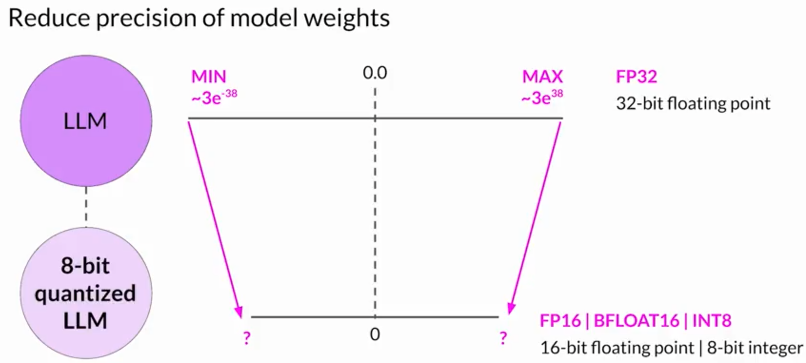

The second method of model optimization, known as post-training quantization (PTQ), is a crucial step for preparing a large language model (LLM) for deployment. Here's an overview of PTQ:

1. **Quantization Overview:**
   1. PTQ is the process of converting a model's weights to a lower precision format after the model has been trained.
   2. This can involve changing the weights to 16-bit floating-point or 8-bit integer formats.
2. **Benefits of PTQ:**
   1. Reducing the precision of the weights decreases the model's size and memory footprint.
   2. It also lowers the computational resources required for running the model (model serving).
3. **Scope of Quantization:**
   1. Quantization can be applied selectively: either to the model weights alone or to both the weights and the activation layers.
   2. This choice depends on the specific requirements and constraints of the deployment scenario.
4. **Quantization and Model Performance:**
   1. While quantization effectively reduces the model's size and computational demand, it's important to balance these benefits against any potential impact on model performance.
   2. The key is to achieve a reduction in resource usage without significantly compromising the accuracy or efficacy of the model.

PTQ is a valuable technique for optimizing LLMs, particularly in environments where resources are constrained or where high-speed inference is a priority. By carefully applying PTQ, it's possible to make these powerful models more accessible and practical for a wider range of applications and devices.

  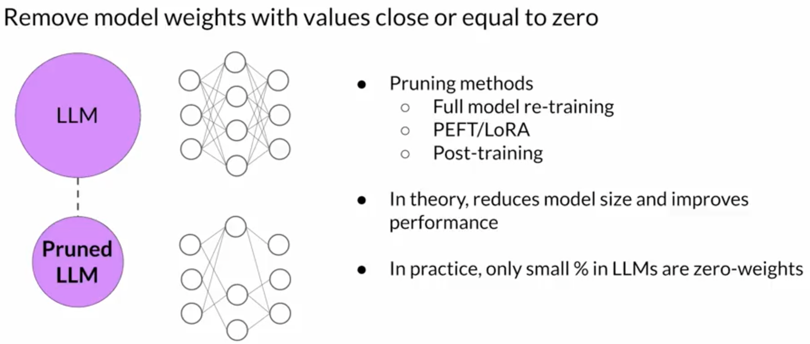

The final optimization technique for large language models (LLMs) is pruning, which focuses on reducing the model size for inference. Here's a detailed look at how pruning works:

1. **Pruning Overview:**
   1. Pruning aims to decrease the model size by removing weights that contribute minimally to the model's overall performance.
   2. Typically, these are weights with values near or equal to zero.
2. **Pruning Methods:**
   1. Some pruning approaches require retraining the entire model to maintain performance after the removal of weights.
   2. Other methods fall under parameter-efficient fine-tuning, like LoRA, which selectively updates certain model components.
3. **Post-Training Pruning:**
   1. This involves reducing the model's size after training is complete.
   2. Theoretical benefits include a smaller model and potential performance improvements.
   3. However, the practical impact on size and performance might be limited if only a small proportion of the model's weights are near zero.
4. **Quantization, Distillation, and Pruning Goals:**
   1. All three techniques – quantization, distillation, and pruning – aim to reduce the model's size to enhance performance during inference while preserving accuracy.
   2. They address different aspects of model optimization and can be chosen based on specific deployment needs.
5. **Importance in Deployment:**
   1. Optimizing your model effectively for deployment is crucial. It ensures that your application functions efficiently and provides users with the best possible experience.
   2. The choice of optimization technique depends on factors like the computational resources available, the required inference speed, and the model's intended use.

By carefully applying these optimization methods, you can make LLMs more practical and effective for a wide range of applications, from cloud-based solutions to edge devices.

## Generative AI - Time and Effort in the Lifecycle

Everything mentioned so far, from selecting your model to fine-tuning it and aligning it with human preferences, will happen before you deploy your application.

  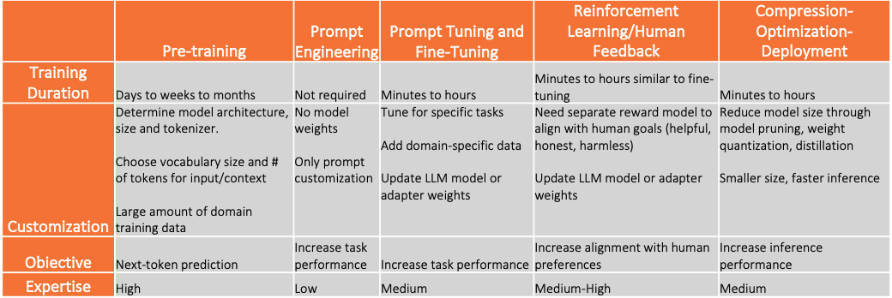

This cheat sheet is designed to help you plan the stages of a Generative AI project. It gives an idea of the time and effort needed for each phase.

Pre-training a large language model (LLM) is a big task. It's complex due to decisions about the model's design, the large amount of data needed for training, and the level of expertise required. However, typically, you'll begin with an existing basic model, so you might skip this stage.

If you're starting with a foundational model, you'll first check its performance through prompt engineering, which is less technical and doesn't need additional model training.

If the model isn't performing as needed, consider prompt tuning and fine-tuning next. Your approach here, whether full fine-tuning or more efficient methods like **Laura** or prompt tuning, depends on your specific needs, goals, and available computing resources. Fine-tuning requires some technical know-how but can be quite effective even with a small dataset, possibly completing in a day.

Aligning your model using reinforcement learning from human feedback can be quick if you already have a reward model. Creating a reward model from scratch takes longer due to the effort in collecting human feedback.

Optimization techniques are generally moderate in complexity and effort and can be done relatively quickly as long as they don't significantly affect the model's performance.

## LLM and Applications

While training, tuning, and aligning can improve your model for applications, there are broader challenges with LLMs that training alone doesn't solve.

One issue is outdated knowledge. For instance, an LLM trained in early 2022 might say Boris Johnson is the British Prime Minister, not knowing he left office later that year.

LLMs also struggle with complex math. They don't actually do math but try to predict the next likely word or number, which can lead to incorrect answers.

Finally, LLMs can **hallucinate** or make up answers. An example is inventing a non-existent plant like the **Martian Dunetree**. Despite no evidence of life on Mars, the model might still generate such fictional information.

**Note:** A Martian Dunetree is a type of extraterrestrial plant found on Mars.

In this part, you will learn about some techniques that you can use to help your LLM overcome these issues by connecting to external data sources and applications.

  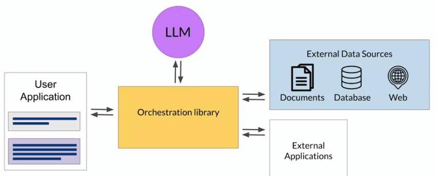

To integrate a Large Language Model (LLM) into your application with external components, you'll need to manage user input and the LLM's responses. This is usually done through an orchestration library, which also allows the LLM to access external data sources or connect to other applications' APIs. This setup can significantly enhance the LLM's performance at runtime.

A notable example of this integration is Langchain, which focuses on connecting LLMs to external data sources.

  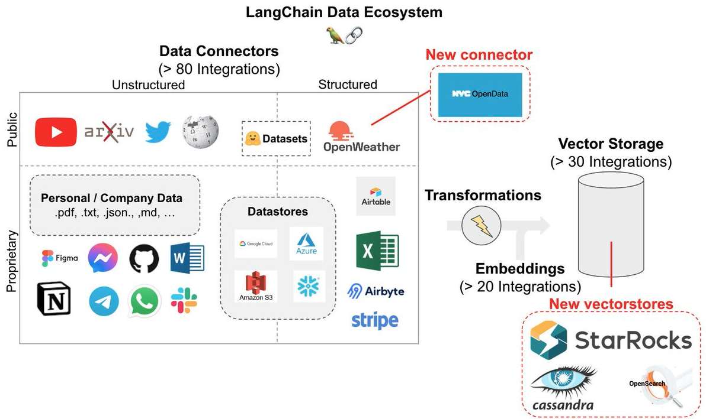

**Retrieval Augmented Generation** (RAG) is a framework designed for LLM-powered systems that utilize external data sources and applications. This method helps to address the knowledge limitations of LLMs. Instead of continuously retraining the LLM with new data, which can be costly and time-consuming, RAG provides a way to update the model's knowledge more efficiently.

With RAG, your model can access external information during inference. This could be recent documents not included in the original training set, or exclusive data from your organization's private databases. By doing so, the model's responses become more relevant and accurate.

RAG isn't a single technology but a framework for giving LLMs access to unseen data. Various implementations exist, and the one you choose depends on your specific needs and the data you have.

The original RAG concept, outlined in a [2020 Facebook research paper](https://research.facebook.com/publications/retrieval-augmented-generation-for-knowledge-intensive-nlp-tasks/), revolves around a component called the **Retriever**. This component has a query encoder and an external data source. The encoder translates the user's input into a format suitable for querying the data source.

In Facebook's implementation, the external data was a vector store, but it could also be a SQL database, CSV files, or another format. The Retriever and the external data are trained to identify the most relevant documents for the input query. The Retriever then combines these documents with the original user query to create an expanded prompt for the LLM, leading to a more informed and accurate response.

For a practical example, consider a lawyer using an LLM during the discovery phase of a case. A RAG setup could enable the lawyer to query a corpus of documents, like previous court filings, to assist in the case. This illustrates how RAG can significantly enhance the functionality and utility of an LLM in real-world applications.

**For example of RAG in Action:**

Imagine you ask an AI system:
- How does photosynthesis work?

**Retrieval:** The AI system quickly searches through its database of scientific texts and finds several sources that explain photosynthesis.

**Generation:** Then, using the information it retrieved, the AI composes a clear, concise explanation about photosynthesis, potentially combining insights from different sources to give a comprehensive answer.

The key advantage of RAG is that it allows AI systems to provide responses that are informed by a vast amount of information, more than they could store in their own memory (like a human brain). This makes RAG powerful for tasks like answering complex questions, writing essays, or even creating content on topics that require up-to-date or specialized knowledge.

The implementation of Retrieval-Augmented Generation (RAG) models is an advanced approach in language modeling that addresses certain limitations like knowledge cutoffs and hallucinations (generating incorrect or irrelevant information).

Here's an overview of how RAG works and the key considerations for its implementation:

1. **Integration with External Information Sources:**
   1. RAG models can access various external data sources, enhancing the model's ability to provide accurate and up-to-date information.
   2. They can utilize local documents (e.g., private wikis, expert systems), access internet resources (like Wikipedia), and even interact with databases through encoded SQL queries.
2. **Use of Vector Stores:**
   1. Vector stores contain vector representations of text, aligning with how language models internally represent language.
   2. They enable efficient and relevant searches based on similarity, enhancing the model's ability to find and use pertinent information.
3. **Context Window Size Consideration:**
   1. Most text sources are too lengthy to fit within the limited context window of a language model.
   2. External data is divided into smaller chunks, each fitting within the model's context window. Tools like Langchain can automate this process.
4. **Data Format and Retrieval:**
   1. Large language models convert text into vector representations, identifying semantically related words using methods like cosine similarity.
   2. In RAG, small chunks of external data are processed through the LLM to create embedding vectors for each segment.
5. **Creation and Use of Vector Databases:**
   1. The generated embedding vectors are stored in vector stores or vector databases, facilitating quick and efficient searches for relevant data.
   2. Vector databases can tag each vector with a key, allowing the text generated by RAG to include citations for the source documents.
6. **Enhancing User Experience:**
   1. By providing current, relevant information and reducing the occurrence of hallucinations, RAG models can significantly improve user experience.
   2. They offer a more dynamic, responsive, and accurate interaction compared to traditional LLMs.

Implementing RAG involves handling these technical considerations carefully to fully leverage its capabilities, thereby enhancing the quality and reliability of the language model's outputs.

## Program-Aided Language Models (PAL)

The ability of LLMs to carry out arithmetic and other mathematical operations is limited. While you can try using chain of thought prompting to overcome this, it will only get you so far. Even if the model correctly reasons through a problem, it may still get the individual math operations wrong, especially with larger numbers or complex operations.

  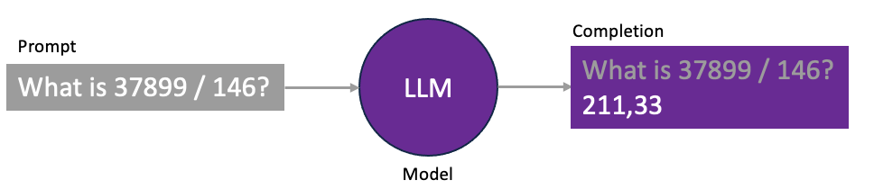

The example of a large language model (LLM) acting like a calculator but providing incorrect answers illustrates an important limitation. In such cases, the LLM isn't performing actual mathematical calculations. Instead, it's predicting the most likely tokens that would follow a given prompt, based on its training data. When these predictions involve numerical calculations, the model may not always produce accurate results.

This limitation can lead to various practical issues depending on the application. For instance, in a commercial setting, it could result in charging customers incorrect amounts. In a culinary context, it might lead to wrong measurements in a recipe, affecting the dish's outcome.

To address this challenge, you can integrate your LLM with external applications that excel in specific tasks, such as mathematical calculations. One effective solution is to enable the LLM to interact with a Python interpreter. This approach would allow the LLM to leverage the computational capabilities of Python for accurate mathematical operations, thereby enhancing the model's utility and reliability in scenarios requiring precise numerical computations. Integrating such specialized tools can significantly improve the overall performance and applicability of your LLM in diverse use cases.

  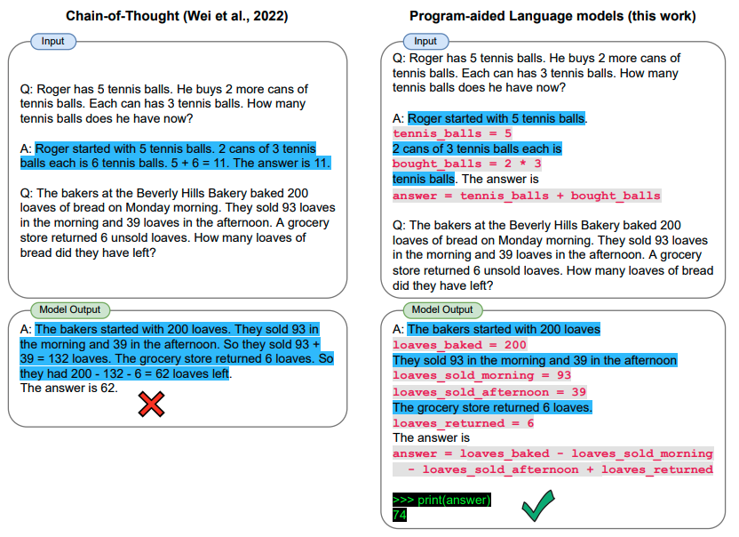

An interesting method to enhance Language Learning Models (LLMs) is known as Program-Aided Language models, or PAL. This idea was first introduced in 2022 by Luyu Gao and others at Carnegie Mellon University. PAL combines an LLM with an external code interpreter, enabling it to perform calculations. It uses a technique called 'chain of thought prompting' to create Python scripts that can be executed. These scripts are then run by an interpreter. The image on the right in the paper shows some example prompts and their responses.

The main idea of PAL is to get the LLM to produce answers where the reasoning steps include computer code. This code is sent to an interpreter to do the necessary calculations for solving the problem. You can guide the model on how to format its output by giving examples of one or a few short inferences in your question.

- **To get the complete story about Roger's purchase of tennis balls:** [Click here!](https://arxiv.org/pdf/2211.10435.pdf)

- **Note:** Some images in this block were sourced from **Coursera**. For more technical information and background: [Click here](https://www.coursera.org/learn/generative-ai-with-llms)